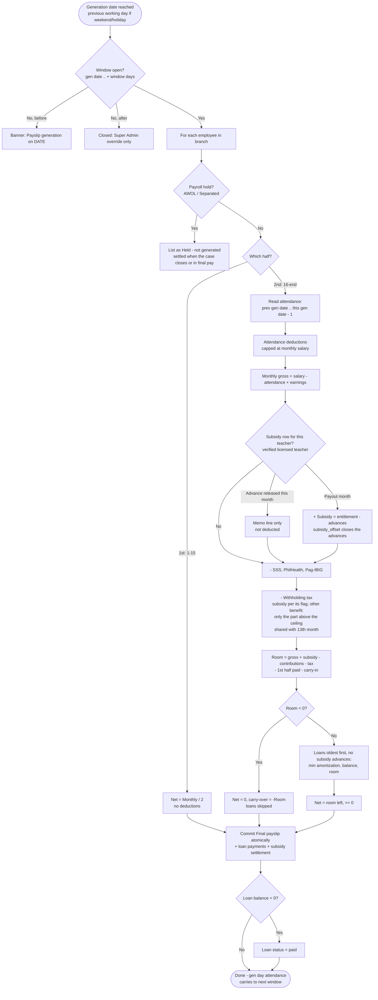
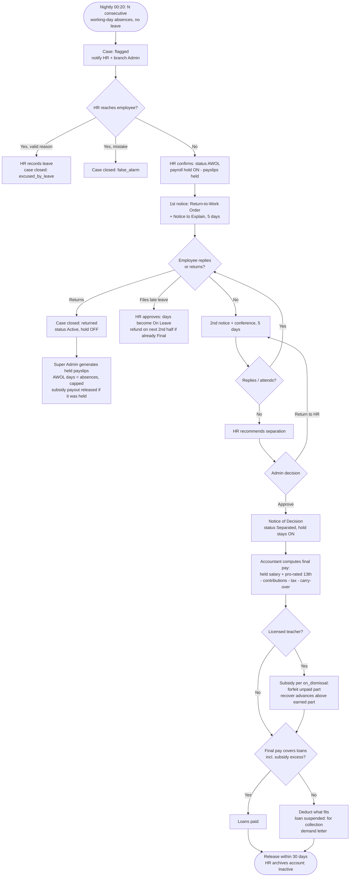
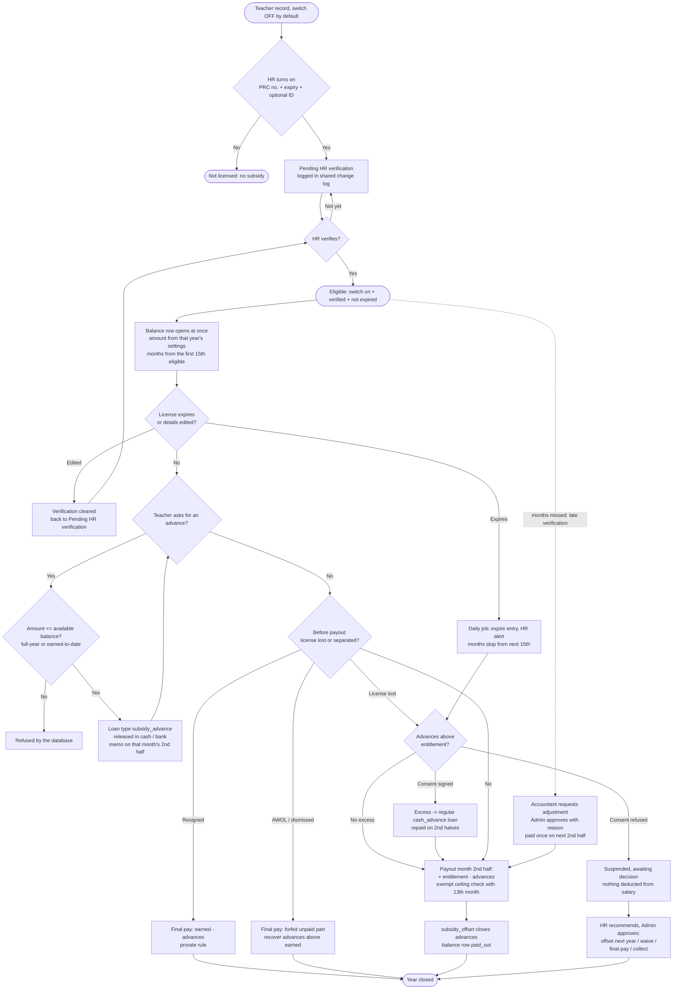

# Payslip Schedule, Loans, AWOL Policy and Teacher Subsidy — Design

Status (October 10, 2026): **built, applied to live, not yet committed or deployed.**

- **Stage 2 (live database):** `20261009010000_payslip_schedule_loans_awol_subsidy.sql`
  (§8 Part A), `20261009020000_payroll_commit_loans_subsidy.sql` (loan, subsidy and
  adjustment writes inside `payroll_commit_entries`, plus `role_permissions` seeds) and
  `20261009030000_cash_advances_read_only.sql` (§8 Part B) are applied. The live
  `payroll_cash_advances` table was empty, so the move script had nothing to move.
- **Stage 3 (code):** on branch `feat/payslip-schedule-loans-awol-subsidy`. The
  actual file list differs slightly from §11. Admin uses one combined Approvals page
  (`src/components/portal/approvals-page.jsx`) instead of a separate AWOL decisions
  page, and the settings APIs live under `src/app/api/admin/`. Payslips (PDF, employee
  view, deduction explanation) and the Accountant preview show loan repayments and the
  licensed-teacher subsidy.
- **Before go-live:** deploy the branch before the old rule opens Oct 1–15 generation
  (Oct 12 on the code deployed now). Clean the 7 test accounts that the AWOL check flags.

## Decisions (October 9, 2026)

| # | Decision | Where |
|---|---|---|
| 1 | The payslip schedule **replaces** the live `attendance_lock_day = 15` | §1 |
| 2 | AWOL employees' payslips are **held, not generated**, until HR closes the case and, if they are separated, the Accountant computes final pay | §5 |
| 3 | The daily-rate divisor stays a Super Admin setting, with the default changed to the school's real working days (**261**, Mon–Fri). Attendance deductions are **capped** so gross pay is never below zero | §3 |
| 4 | When a generation date falls on a weekend or holiday, it moves to the **previous working day** | §1 |
| 5 | **One loan system.** New cash advances go through Loans; active old ones are migrated; `payroll_cash_advances` becomes read-only history | §4 |
| 6 | New feature: **Licensed Teacher Annual Subsidy** | §6 |

## Decisions (October 9, 2026 — second round)

| # | Decision | Where |
|---|---|---|
| 7 | Payout on the 2nd-half payslip of a chosen month: approved | §6.2 |
| 8 | Subsidy advance as a loan type: approved | §4, §6.1 |
| 9 | Edge-case defaults approved; all stay Super Admin settings | §6.2, §6.4 |
| 10 | Tax as "other benefit": approved. The ₱90,000 check **combines the subsidy and 13th month pay**, and the ceiling is an **editable Super Admin setting** (pending the accountant's confirmation) | §6.5 |
| 11 | License lost after a big advance → a regular loan with signed consent. **Fallback:** if the teacher refuses, HR and the Admin decide the next step, and nothing is deducted from salary meanwhile | §6.4, §6.7 |
| 12 | One shared change log: approved. It also records every license change | §8 |
| 13 | New: licensed-teacher fields in the Create/Edit Employee form, with HR verification and an expiry warning | §6.6 |

**Unlicensed teachers are normal.** `is_licensed_teacher` defaults to off.
While it is off, the PRC fields are hidden and not required, and the teacher
is not in the subsidy. When HR turns it on and verifies the license, the
subsidy starts under the approved month rule, and the change is logged.

**Build order once approved:** the migration (§8 Part A) first.

## Decisions (October 9, 2026 — third round)

| # | Decision | Where |
|---|---|---|
| 14 | "Starts from that month" with the 15th rule: approved | §6.2 |
| 15 | No backdating: approved. **Missed amounts are paid as a manual adjustment** on a later 2nd-half payslip, with **Admin approval and a reason** | §6.8 |
| 16 | **License field permissions** (replaces the earlier HR + Admin edit and the Admin "Licensed Teachers" page): **HR** edits and verifies · **Admin** view-only · **Super Admin** view-only · **Accountant, Employee** no access. Any edit to the PRC number, expiry or ID still clears verification; every change is logged | §6.6, §9.3 |

**Build stages:**
- **Stage 1:** write §8 Part A and test it on a Supabase branch or a
  copy. Report the results; nothing goes to the live database.
- **Stage 2:** apply to live, only after approval.
- **Stage 3:** code changes, only after approval.

## Decisions (October 9, 2026 — fourth round)

| # | Decision | Where |
|---|---|---|
| 17 | Admin payroll access = **view + approve loan decisions and subsidy adjustments only**; no other payroll edits | `SACS-Payroll-Permission-Matrix.md` rows 4a, 10a |
| 18 | One combined Approvals page for Admin: approved | §9, §11 |

**Stage 1 status: done, waiting for approval.**
- Migration file: `supabase/migrations/20261009010000_payslip_schedule_loans_awol_subsidy.sql`,
  generated from Part A below. **Not applied to live.**
- Tested on a local copy (PGlite, PostgreSQL 17) because creating a
  Supabase branch was declined.
- 88 / 88 checks pass, and the migration runs twice cleanly.
- One bug was fixed: clearing a loan's balance now also clears
  `awaiting_decision`.
- Live prerequisites were confirmed with read-only catalog queries.

## What this builds on (live today)

| Already live | Where |
|---|---|
| 1st half = Rate (monthly ÷ 2), no deductions; 2nd half settles the month | `src/lib/payroll/semi-monthly.js` |
| Negative 2nd half → paid ₱0, the rest carries to next month | `semi-monthly.js` (`carry_over_out`) |
| SSS ₱400, Pag-IBIG ₱200, PhilHealth ₱0, late not deducted | `payroll_rate_configs` (school sheet) |
| Divisor setting "Working days per year" (school row: 24) | Super Admin → Payroll Rates, `src/lib/payroll/rates.js` |
| Cash advances, partial deduction, never below ₱0 net | `src/lib/payroll/cash-advance.js` (**replaced by Loans, §4**) |
| Holiday calendar, rest days (Sat/Sun + whole-day holidays) | `attendance_is_rest_day()` |
| Generation opened 3 days before period end (old rule; the fallback now opens on the last day) | `src/lib/payroll/generation-window.js` (**replaced by §1**) |
| `profiles.date_hired` | used for subsidy proration (§6) |

---

## 1. Pay periods and the payslip schedule

### Rules

| Period | Generated on (default) | Pays | Deducts |
|---|---|---|---|
| 1st half, 1–15 | **the 15th** → next working day if needed (decision of Oct 10, 2026) | Rate (monthly ÷ 2) | nothing |
| 2nd half, 16–end | **last day of the month** → previous working day if needed | Rate + earnings (incl. subsidy payout) | everything for the month |

**Processing-day rule:** the generation day is not part of the attendance it
pays. Its RFID taps are read by the next window.

The only payslip that reads attendance is the 2nd half, so the rule sets the
month's **attendance window**:

```
Attendance window for month M = (last month's 2nd-half generation date)
                              → (this month's 2nd-half generation date − 1)
```

With the default rules (2nd half: previous working day, decision 4; 1st half:
next working day, Oct 10, 2026 — it deducts nothing, so moving it later changes
no attendance). Each half's rule is a Super Admin setting:

| Payslip | Generated | Why | Attendance it deducts | Carried to next window |
|---|---|---|---|---|
| Oct 1–15, 2026 | Thu Oct 15 | — | (none) | — |
| Oct 16–31, 2026 | **Fri Oct 30** | Oct 31 is a Saturday | Oct 1 – Oct 29 | Oct 30 |
| Nov 1–15, 2026 | **Mon Nov 16** | Nov 15 is a Sunday | (none) | — |
| Nov 16–30, 2026 | **Fri Nov 27** | Nov 30 is Bonifacio Day | Oct 30 – Nov 26 | Nov 27 |
| Dec 16–31, 2026 | **Tue Dec 29** | Dec 31 and Dec 30 are holidays | Nov 27 – Dec 28 | Dec 29 |

**Replacing lock day 15 (decision 1):** the payroll reads the cut-off from
the schedule (`payroll_schedule_for().attendance_cutoff`) instead of the
`attendance_lock_day` rate. Old rate rows are kept as history, not deleted.
No 2nd-half payslip has been generated under lock day 15 yet, so the
October switch loses and double-counts nothing. Leave and incentives filed
after a cut-off move to the next month, as they do today.

### Generation window

```
opens_on  = generation date (after the previous-working-day rule)
closes_on = opens_on + window_days − 1          (default 5 days)

before opens_on      → "not open"   ("Payslip generation on Oct 15, 2026")
opens_on..closes_on  → "open"       Final payslip; attendance is complete
after closes_on      → "closed"     Super Admin override only (existing)
```

The pay date still comes from the Pay Calendar and is unchanged.

**Dashboard banner:**
`October 1–15, 2026: Payslip generation on Oct 15, 2026 · open until Oct 19, 2026`

### Super Admin settings (effective-dated)

| Setting | Default | Allowed |
|---|---|---|
| 1st-half generation day | 15 (last day of the period) | 1–15 |
| 2nd-half generation day | last day of the month | 16–31 (31 = month end in short months) |
| Window length | 5 days | 1–15 |
| Weekend / holiday rule | **previous working day** | same day · previous working day · next working day |

- A change takes effect from a chosen period. That period's generation date
  must not have arrived yet, under both the old and the new setting.
  Payslips already generated are never touched. The database enforces this.
- Each save adds a new version. Trigger writes **who / when / old / new /
  reason** to `payroll_setting_changes`, which is shared with the subsidy settings.

---

## 2. Computation flow

### 1st half (1–15)

1. Skip employees on **payroll hold** (AWOL / Separated, §5) and list them as "Held".
2. Earnings = Rate (monthly ÷ 2).
3. Deductions = none. Net pay = Rate.
4. Save as Final and lock it.

### 2nd half (16–end)

1. Skip employees on payroll hold.
2. Read attendance for the month window (§1): absences, leave without pay,
   lates, undertime, half days, unpaid holidays.
3. Attendance deductions = their sum, **capped at the monthly salary**.
4. Monthly gross = monthly salary − attendance deductions + incentives / overload / premiums.
5. **Subsidy (licensed teachers, §6):**
   - in the month an advance was released: memo line only, not deducted;
   - in the payout month: earning "Licensed teacher subsidy" = entitlement − advances;
   - any Admin-approved missed-month adjustment (§6.8): earning, paid once.
6. Government contributions (SSS, PhilHealth, Pag-IBIG, employee share).
7. Withholding tax from the monthly table, on gross − contributions (plus any taxable subsidy part).
8. Room = gross + subsidy payout − contributions − tax − 1st half paid − carry-in.
9. If room < 0: net ₱0, carry-over = −room, and no loan is deducted. Stop.
10. Loans (oldest first, **subsidy advances excluded**): each takes `min(amortization, balance, room left)`.
11. Net pay = room left (always ≥ ₱0).
12. Commit atomically: the payslip, its loan payments, and its subsidy settlement.

**Order when pay is short:** contributions → tax → carry-in → loans → other.

---

## 3. Formulas

```
Rate (half)        = Monthly ÷ 2
Daily rate         = Monthly × 12 ÷ working days per year   (default 261 = Mon–Fri)
Hourly rate        = Daily ÷ 8
Per-minute rate    = Hourly ÷ 60

Absences           = Daily × (absent days + leave-without-pay days + unpaid holidays)
Lates              = Per-minute × late minutes      (school: switched off today)
Undertime          = Per-minute × undertime minutes
Half day           = Daily × half_day_pct
Attendance deds    = min(Absences + Lates + Undertime + Half days, Monthly)   ← cap

Monthly gross      = Monthly − Attendance deds + Incentives + Overload + Premiums
Contributions      = SSS + PhilHealth + Pag-IBIG    (school: 400 + 0 + 200)
Taxable            = Monthly gross − Contributions (+ taxable subsidy, §6.5)
Tax                = base + rate × (Taxable − bracket_over)   (BIR monthly table)

Room               = Monthly gross + Subsidy payout − Contributions − Tax
                     − 1st half paid − Carry-in
Loan deduction     = min(amortization, remaining balance, max(0, room))
2nd half net       = max(0, Room − Loans − Other)
Carry-over out     = max(0, −Room)
```

### Divisor and cap (decision 3)

- **Setting:** Super Admin → Payroll Rates → *Working days per year*. This
  already exists and is effective-dated. A new version with value **261**
  (Mon–Fri: 52 × 5 + 1) takes effect Oct 1, 2026, replacing the school's 24.
  Use 313 if Saturdays become school days.
- **Why 261 and not "count each month's days":** a fixed number keeps the
  daily rate the same every month. Counting days would charge a February
  absence more than a March one.
- **Why the cap:** 261 makes Daily = 30,000 × 12 ÷ 261 = ₱1,379.31. A teacher
  absent all 22 working days of a month would lose 22 × 1,379.31 =
  ₱30,344.82, which is more than the ₱30,000 salary. The cap stops the
  deduction at ₱30,000, so gross is ₱0, never negative.

---

## 4. Loans (one system)

| Field | Notes |
|---|---|
| employee, loan type | `salary_loan` · `cash_advance` · `emergency_loan` · `other` · `subsidy_advance` (§6) |
| principal, interest % | flat interest on the whole loan (always 0 for a subsidy advance) |
| total payable | principal + interest (computed by the DB) |
| number of payrolls, amortization | per 2nd-half payslip; empty for a subsidy advance |
| start period | always a 16th, because loans are deducted on the 2nd half only |
| remaining balance | maintained only by the payments trigger |
| status | `active` → `paid` (automatic at ₱0) · `suspended` (manual, with reason) |
| final-pay authority | the employee signed consent to deduct the balance from final pay |
| legacy cash advance | link to the old `payroll_cash_advances` row, if it was migrated |

**Rules enforced in the database:**
- A payment can never exceed the remaining balance.
- Only one live payroll payment per loan per period. An overridden payslip
  first reverses its old payment.
- A balance of ₱0 sets the loan to `paid`. A reversal on a paid loan reopens it to `active`.
- Payroll never deducts a suspended loan or a subsidy advance. A subsidy
  advance is closed only by the subsidy itself (`subsidy_offset`) or by final pay.

**Short net pay:** take a **partial deduction and extend the loan**. Deduct
what fits; the shortfall stays on the balance, so the loan runs one payroll
longer. A payslip is never negative, and a later payslip never takes a double
deduction by surprise.

### Moving cash advances into Loans (decision 5)

1. **Schema** (§8 part A) adds `payroll_loans.legacy_cash_advance_id`.
2. **Script** `scripts/migrate-cash-advances-to-loans.mjs`. Run it right
   after a 2nd-half batch is Final. For each `active` / `on_hold` advance:
   - repaid so far = `repaidByAdvance()` from Final payslips (the existing logic);
   - balance = principal − repaid; skip it if ₱0;
   - insert a loan: type `cash_advance`, 0% interest, same principal;
     amortization = installment × 2 if `deduct_on = 'both'`, else × 1
     (capped at the balance), so the monthly pace stays the same now that
     loans come off the 2nd half only; start period = the next 16th;
     `on_hold` → `suspended`;
   - insert a `manual` payment for the amount already repaid, with the note
     "Repaid on payslips before the move to Loans". The loan's balance then
     matches the old one exactly.
3. **Lock** (§8 part B) makes `payroll_cash_advances` read-only. Old payslips
   keep their `cash_advance` lines, and the Cash Advances page becomes a
   read-only history tab under Loans.

**Who does what:** the Accountant encodes loans for their branch. A Super
Admin can suspend a loan. Employees view their own loans. HR has no payroll
access (permission matrix #10–13).

---

## 5. AWOL policy

AWOL is not automatically abandonment. Separation needs the two-notice due
process: a notice to explain, a chance to be heard, and a notice of decision.
The system's job is to flag the case early, hold pay, and keep the paper trail.

### 5.1 Status flow

```
Active ──(HR confirms)──► AWOL ──(Admin approves separation)──► Separated ──(final pay released, HR archives)──► Inactive
   ▲                       │
   └──(returns / excused)──┘
```

| Status | Payroll hold | Payslips |
|---|---|---|
| Active | off | normal |
| AWOL | **on** | not generated; listed as "Held – AWOL" |
| Separated | **on** | no regular payslips; everything settles in final pay |

**When the hold ends (decision 2):**
- **Returned / excused:** HR closes the case, the status goes back to
  Active and the hold lifts. Held payslips are then generated through
  Super Admin override.
- **Separated:** the hold never lifts. The held periods are paid only
  through the final pay the Accountant computes.

A database trigger sets the hold whenever `employee_status` changes, so it can't be forgotten.

### 5.2 Timeline (configurable, defaults shown)

| When | Who | What |
|---|---|---|
| 3rd consecutive working day absent, with no leave filed | System (00:20 nightly) | Opens an AWOL case (`flagged`) and notifies HR and the branch Admin |
| Next working day | **HR** | Calls the employee and the emergency contact. If unreachable: confirms the case, sets status to AWOL (hold on), and sends **1st notice**: Return-to-Work Order + Notice to Explain by email and courier to the last known address. Reply due in 5 calendar days |
| No reply | **HR** | **2nd notice**: final Return-to-Work Order + invitation to an administrative conference. Reply due in 5 calendar days |
| Conference held or missed | **HR** | Recommends an outcome with reasons |
| Decision | **Admin** (branch) | Approves separation, or returns the case to HR. Notice of Decision served. Status becomes Separated |
| Within 30 days of separation | **Accountant** computes, **Admin** views | Final pay released after clearance (DOLE Labor Advisory 06-2020) |
| Any time | **Super Admin** | Oversight, override to generate held payslips for a returned employee |

Case outcomes: `false_alarm` · `returned` · `excused_by_leave` · `separated`.

### 5.3 Effect on each payslip

| Item | AWOL rule |
|---|---|
| 1st and 2nd half | Held: not generated while AWOL |
| Gross | Each AWOL working day is an absence (Daily × days), capped at the monthly salary. Rest days and holidays are not AWOL days |
| SSS / PhilHealth / Pag-IBIG | Deducted for any month with earnings. A month with no earnings has no contribution |
| Tax | Computed on actual taxable pay. Annualized in final pay |
| Loan | Partial + extend (§4). If separated, the balance comes from final pay |
| Teacher subsidy | Settled in final pay under the dismissal rule (§6.4) |
| Net ≤ 0 | Never a negative payslip: net ₱0 and a carry-over, which final pay collects |

### 5.4 Final pay (if separated)

```
+ unpaid salary up to the separation date
+ pro-rated 13th month   (owed regardless of the reason for separation)
+ convertible unused leave
+ teacher subsidy earned and not yet paid (if the rule is "prorate")
− contributions due on that pay
− tax (annualized; refund if over-withheld)
− carry-over owed
− loan balances, including subsidy advances above what was earned
  (only if the final-pay authority is on file)
= final pay (≥ ₱0)
```

If final pay can't cover a loan, deduct what fits and leave the rest on the
loan as `suspended` with reason "Separated – for collection". The school
then sends a demand letter. A negative final pay is never issued.

### 5.5 Edge cases

| Case | Handling |
|---|---|
| **Returns mid-period** | HR closes the case as `returned` and the hold lifts. Held payslips are generated through override, and the days missed are absences (example 7.3). Discipline is a separate HR matter |
| **Files leave late** | HR approves → the days become On Leave through the existing leave sync. If the affected payslip is already Final, the refund appears on the next 2nd half as an adjustment. A Final payslip is never reopened |
| **Holiday inside the AWOL range** | Status Holiday: neither an absence nor an AWOL day. **Unpaid** if the employee was absent on the working day before it, and deducted as `unpaid_holiday` |
| **AWOL spans a generation day** | Everyone else is generated; the employee appears as "Held – AWOL". The generation day's attendance carries to the next window, so nothing is counted twice |
| Schedule changed during a case | No effect: each held period uses its own settings |

---

## 6. Licensed Teacher Annual Subsidy

### 6.1 Rules

- **Eligible on a day** = employee type Teaching **and** licensed-teacher
  switch on **and** license verified by HR **and** license not expired on
  that day. All of it is set in the employee form (§6.6), and every change
  goes to the shared change log.
- The **annual amount** (default ₱24,000) is a Super Admin setting. It is never hardcoded.
- Each teacher has **one balance row per subsidy year**, which keeps the
  amount granted under that year's settings.
- The teacher receives the subsidy in one of two ways, or both:
  1. **Advance:** a Loan of type `subsidy_advance`, released in cash or by
     bank transfer like a cash advance. It is never deducted from salary.
     It can't exceed the remaining subsidy balance.
  2. **Year-end:** paid on the **2nd-half payslip of the payout month**.
     Payout = entitlement − advances already taken.

### 6.2 Super Admin settings (versioned per subsidy year)

| Setting | Default | Options |
|---|---|---|
| Annual subsidy amount | ₱24,000 | any amount > 0 |
| Subsidy year | Calendar year (Jan 1 – Dec 31) | Calendar · School year (starts on the 1st of a chosen month, e.g. June 1 – May 31) |
| Year-end payout | 2nd-half payslip of the year's last month | any month of the year |
| Mid-year hire / newly licensed | Prorate by month | Prorate · Full amount |
| Advance limit | Full-year balance | Full-year balance · Earned to date |
| On resignation | Prorate (earned part paid in final pay) | Prorate · Forfeit |
| On dismissal (AWOL / for cause) | Forfeit the unpaid part | Prorate · Forfeit |
| Tax treatment | Other benefit (shares the exempt ceiling with the 13th month) | Other benefit · Taxable · Exempt |
| License expiry warning | 60 days before expiry | 1–365 days (`system_config` hr.license_expiry_warning_days) |

The **exempt ceiling** (default ₱90,000) is not a subsidy setting. It is a
tax figure shared with the 13th month, so it lives in Super Admin → Payroll
Rates as *Other benefits exempt ceiling* (`benefits_exempt_ceiling`). It is
effective-dated like every other rate.

- A change applies to the **next subsidy year only**. The database refuses
  a version that starts on or before the current year's end.
- Each save adds a version and is logged with who, when, old value, new
  value and reason, in the same `payroll_setting_changes` as the schedule.
- Switching from calendar to school year creates one short bridge year
  (e.g. Jan 1 – May 31, 2028), prorated by month.
- **Month rule:** a month counts if the teacher is employed and **eligible**
  (switch on, verified, not expired) on the 15th. Verified on Jun 10 →
  June counts. Verified on Jun 20 → the subsidy starts in July. Future
  months are projected only while the current license stays valid, so an
  advance can't be taken against months after the expiry date.

### 6.3 Where it appears on the payslip

| Event | Payslip | Line | Effect on net |
|---|---|---|---|
| Advance released (Loans) | 2nd half of that month | Memo: "Subsidy advance released Jun 10, 2027: ₱10,000 · not deducted · balance ₱14,000" | none (already paid in cash) |
| Year-end payout | 2nd half of the payout month | Earning: "Licensed teacher subsidy 2027: ₱24,000 − advances ₱10,000 = ₱14,000" | + payout |
| Approved missed-month adjustment (§6.8) | next 2nd half after approval | Earning: "Licensed teacher subsidy — adjustment (Jul 2027): ₱2,000" | + adjustment |
| Separation | Final pay | Earning (earned part not yet paid) or deduction (advances above the earned part) | ± |

At payout, each subsidy advance gets a `subsidy_offset` payment, so the
advance loan closes as `paid` without touching salary.

### 6.4 Edge cases

| Case | Recommended handling |
|---|---|
| **Hired mid-year** | **Prorate by month** (the default). Hired Apr 5 → Apr–Dec = 9 months → ₱18,000. Hired Apr 20 → May–Dec = 8 months → ₱16,000 |
| **Resigns before year-end** | **Prorate.** Earned = amount × months ÷ 12. Final pay adds earned − advances. If advances exceed the earned part, the excess comes from final pay, using the authority signed when the advance was taken |
| **AWOL / dismissed before year-end** | **Forfeit the unpaid part.** Advances up to the earned part are kept. Advances above it are recovered from final pay, and anything final pay can't cover is collected. Nothing is paid out while the payroll hold is on |
| **Amount changed mid-year** | Applies from the **next** subsidy year. The current year's balance rows keep their granted amount (e.g. ₱24,000 for 2027 even if ₱30,000 is saved in September 2027 for 2028) |
| **License lapses mid-year** (expired, not renewed, or switched off) | Months stop counting from the first 15th without eligibility: expired Sep 30 → Jan–Sep = ₱18,000. Year-end pays 18,000 − advances. If advances already exceed that, see §6.7: a regular loan with signed consent, or the HR/Admin fallback. Nothing is deducted from salary without consent |
| **Renews late** | HR enters the new expiry date, which clears verification, then re-verifies. Months count again from the first 15th after re-verification. The gap months are not paid |
| **Becomes licensed mid-year** | HR turns the switch on and verifies. The balance row opens immediately (§8 `payroll_subsidy_refresh`). Verified Jul 1 → Jul–Dec = ₱12,000 |
| **Changes to Non-Teaching** | The switch turns off as part of the same save and is logged. Same handling as a lapse |
| **On payroll hold at the payout month** | The payout waits for the held payslip; the case outcome decides it (returned → paid when the payslip is generated; separated → final pay) |
| **Tax** | Configurable flag (§6.5) |

### 6.5 Tax treatment (configurable flag)

| Flag | Effect |
|---|---|
| **Other benefit** (default) | Shares the exempt ceiling with the 13th month (below). Only the part above the ceiling is taxable |
| Taxable | Added to taxable income: each advance in the month it is released, and the payout in the payout month. Year-end annualization trues up any over-withholding |
| Exempt | Never taxed |

**Combined ceiling check (decision 10).** It is counted per **calendar
(tax) year, by the date paid**, even when the subsidy year is a school year.

```
Benefits paid this tax year = 13th month pay
                            + subsidy advances released   (other-benefit flag only)
                            + subsidy payouts             (other-benefit flag only)
Ceiling                     = benefits_exempt_ceiling rate in force (default ₱90,000)
Taxable excess now          = max(0, Benefits paid incl. this payment − Ceiling)
                              − excess already taxed this year
```

- The excess is added to taxable income on the payslip that crosses the
  ceiling: the subsidy payout's 2nd half, or the 13th-month run if that
  comes later. Each payslip stores the excess it taxed
  (`benefits_excess_taxed` in its breakdown), so it is never taxed twice.
- Final pay applies the same check to the pro-rated 13th month and any
  subsidy settled in it.
- §8 adds the view `payroll_exempt_benefits_paid`, which lists every
  counted payment per employee and tax year.

**Pending** the school accountant's confirmation (decision 10). Changing the
flag or the ceiling later needs no code change.

### 6.6 Licensed-teacher fields in the Create / Edit Employee form

| Field | Shown when | Required | Who edits |
|---|---|---|---|
| Employee type (Teaching / Non-Teaching) | always (existing field) | yes | HR (existing) |
| Licensed teacher (switch, **default off**) | type = Teaching | — | HR |
| PRC license number | switch on | yes | HR |
| License expiry date | switch on | yes, and later than today | HR |
| PRC ID (PDF / PNG / JPEG, ≤ 2 MB) | switch on | no | HR |
| Verified by / verified on | switch on | set by **Verify license** | HR |
| Reason for the change | any license change | yes | HR |

**Access (decision 16):**

| Role | License fields |
|---|---|
| **HR** | Edit and verify (all branches, as HR has today) |
| **Admin** | View only, own branch. No license page; the fields show read-only wherever Admin already sees branch employee records |
| **Super Admin** | View only, all branches |
| **Accountant** | No access. Payroll reads eligibility on the server; the Accountant sees only the subsidy lines and balances needed for payroll, never the PRC number, expiry date, ID or verifier |
| **Employee** | No access. Their payslip still shows the subsidy lines |

**Rules:**
- **Off is a normal state.** While off, the PRC fields are hidden and not
  required, nothing is validated, and the teacher is not in the subsidy.
- **Turning on, or changing the number, expiry date or PRC ID, clears
  verification.** The status shows "Pending HR verification" until HR
  verifies again. Turning on and verifying are two deliberate steps, even
  when the same HR user does both.
- **Verify license:** HR checks the number against the PRC
  online verification and the uploaded ID. Verification stamps
  `verified_by` and `verified_at`, and the subsidy starts under the month rule (§6.2).
- **Changing type to Non-Teaching** turns the switch off in the same save,
  and that is logged.
- **Turning off** clears the PRC number, expiry and ID link on the profile.
  The history rows keep the encrypted values.
- **Status badge** (HR form and employee list; Admin and Super Admin
  read-only views): `Not licensed` · `Pending HR verification` ·
  `Eligible` · `Expiring in N days` · `Expired`.
- **Security:**
  - The PRC number is encrypted with the existing Vault key, like SSS and
    TIN. Screens show the last 4 digits; HR's edit dialog decrypts it.
  - The PRC ID upload is validated like leave proofs (`validateProofUrl`:
    a PDF, PNG or JPEG data URL, 2 MB max). It is stored in its own table,
    so a profile read never carries the file.
  - The database refuses license edits made any other way than through
    the change log (a guard trigger on `profiles`). It also accepts only
    HR (or the system's expiry job) as the author of a change.
  - The API strips the license fields from every Accountant and Employee
    response. Admin responses carry the status, last 4 digits, expiry
    and verifier, never the full number or the ID file. Super Admin
    gets the same read-only view across all branches.
  - This narrows the permission matrix for these fields: Super Admin "Full"
    and Admin "Partial" on employee records become view-only here, and the
    Accountant's "View" becomes no access.

**Expiry warning** (Super Admin setting, default **60 days**):
- A daily job at 00:30 Manila creates one alert per license when it enters
  the warning window, and one more the day after it expires.
- HR sees them in an "Expiring licenses" card on the HR dashboard and as a
  badge on the employee list. HR acknowledges each alert.
- On the day after expiry the job also writes an `expire` entry. That ends
  eligibility, so the next 15th doesn't count.
- No email today: there is no notification table, and pg_cron can't send
  mail. A later option is a daily mail through the existing
  `src/lib/mail/gmail.js`.

Expiry alerts go to HR only, since HR is the only role that can act on them.

**Every change is logged twice:** a row in `employee_license_changes` (the
history the subsidy months are read from), and an entry in the shared
`payroll_setting_changes` (type `teacher_license`). Each entry records who,
when, role, old value, new value and reason. Only the last 4 digits of the
PRC number appear in either log.

### 6.7 Excess advance when the teacher refuses consent (decision 11)

| Step | Who | What |
|---|---|---|
| 1 | System (at payout or license loss) | Excess = advances − entitlement > 0. The subsidy advance stays open with the excess as its balance, `suspended`, flagged **awaiting decision**. Payroll never deducts a subsidy advance, so salary is untouched |
| 2 | Accountant | Offers a regular `cash_advance` loan for the excess with an amortization the teacher agrees to. **Signs** → the subsidy advance closes with a `converted` payment and the new loan starts on the next 2nd half |
| 3 | Teacher **refuses** | The Accountant records the refusal and the case goes to HR |
| 4 | **HR** recommends · **Admin** approves | One of: **offset against next year's subsidy** (if the teacher is re-licensed; carried into next year's balance row) · **waive** (written off with a `waiver` payment and a required reason) · **recover from final pay on separation** (only if the authority signed with the advance covers it) · **refer for collection** |
| 5 | System | The decision, who recommended it and who approved it are stored on the loan. Until the Admin approves, the loan stays suspended and nothing is deducted |

### 6.8 Missed months: manual adjustment (decision 15)

License changes are never backdated, so months can be missed. For
example, a teacher submitted a valid license in May, but HR only verified
it on Jul 20, so May, June and July didn't count. The missed amount is
paid **once, as a manual adjustment** on a later 2nd-half payslip.

| Step | Who | What |
|---|---|---|
| 1 | **Accountant** | Requests an adjustment against the teacher's subsidy balance: months missed, amount, and a **required reason** (e.g. "License valid since May 2; verification delayed by HR backlog"). The amount is capped at the annual amount × months ÷ 12, and counted plus missed months can't exceed 12. The Accountant sees the amounts, not the license details |
| 2 | **Admin** (teacher's branch) | Approves or rejects, with a note. The approver can't be the person who requested it |
| 3 | System | Pays an approved adjustment on the **next 2nd-half payslip** as an earning line "Licensed teacher subsidy — adjustment (May–Jul 2027)", then marks it **applied** with that payslip |
| — | Super Admin | Views all adjustments; no approval role |

- **Tax:** the same flag as the year's subsidy. With "other benefit" the
  adjustment counts toward the combined exempt ceiling, by the date it is
  paid (it's included in `payroll_exempt_benefits_paid`).
- **History:** adjustments are never deleted. A rejected one stays as a
  record with its note.
- **Example:** Ben Cruz (§7.5) was verified Jul 20 instead of Jul 14, so
  he starts in August: 5 months, ₱10,000. The Accountant requests 1 month
  (July) = ₱2,000, reason "Verified late; license valid since Jul 12".
  The Admin approves on Aug 3, and ₱2,000 is paid on the Aug 16–31 payslip.

---

## 7. Worked examples

**Maria Santos**, teacher (not licensed, so no subsidy), monthly ₱30,000,
school settings with the new divisor:

| | |
|---|---|
| Rate (half) | ₱15,000.00 |
| Daily | 30,000 × 12 ÷ 261 = ₱1,379.31 |
| Hourly / per-minute | ₱172.41 / ₱2.8735 |
| Contributions | SSS ₱400 + Pag-IBIG ₱200 = ₱600 |
| **Loan** | Salary loan ₱12,000, 5% flat interest = ₱600, total ₱12,600, 6 payrolls, **₱2,100** per 2nd half, starting Oct 16–31 |

### 7.1 Normal month — October 2026

**Oct 1–15, generated Thu Oct 15:** ₱15,000.00, no deductions.

**Oct 16–31, generated Fri Oct 30:** attendance Oct 1–29 shows 1 absence and
45 late minutes. Lates are switched off at the school today; they are shown
here so the formula is visible.

| | ₱ |
|---|---:|
| Monthly salary | 30,000.00 |
| − Absence (1 × 1,379.31) | 1,379.31 |
| − Late (45 × 2.8735) | 129.31 |
| **Monthly gross** | **28,491.38** |
| − SSS + Pag-IBIG | 600.00 |
| Taxable | 27,891.38 |
| − Tax: (27,891.38 − 20,833) × 15% | 1,058.76 |
| − Loan | 2,100.00 |
| Monthly net | 24,732.62 |
| − 1st half paid | 15,000.00 |
| **2nd half net pay** | **9,732.62** |

Payslip: Rate ₱15,000 − deductions ₱5,267.38 = ₱9,732.62. Loan balance: ₱12,600 → **₱10,500**.

### 7.2 AWOL — 20 working days, separated

Last day present: **Fri Nov 6**. AWOL: **Mon Nov 9 – Mon Dec 7**. That is
20 working days: Nov 9–27 = 15, Nov 30 (Bonifacio Day) not counted,
Dec 1–4 and Dec 7 = 5.

| Date | Event |
|---|---|
| Wed Nov 11 (night) | 3rd absent day → case flagged |
| Thu Nov 12 | HR can't reach the employee or the emergency contact → **AWOL**, hold on, 1st notice (reply by Nov 17) |
| Mon Nov 16 | 1st-half generation: Maria listed as **Held** |
| Wed Nov 18 | No reply → 2nd notice, conference Nov 25 |
| Wed Nov 25 | No-show → HR recommends separation |
| Fri Nov 27 | 2nd-half generation: Maria **Held**. Nov 27 is itself an AWOL day; it falls in December's window |
| Fri Dec 4 | Admin approves |
| Mon Dec 7 | Notice of Decision → **Separated**, effective Dec 7 |
| by Wed Jan 6, 2027 | Final pay released |

**Final pay:**

| | ₱ |
|---|---:|
| November (window Oct 30 – Nov 26): 30,000 − 14 × 1,379.31 | 10,689.66 |
| Nov 27 – Dec 7: no days worked; Nov 30 holiday unpaid (absent Nov 27) | 0.00 |
| Pro-rated 13th month: (270,000 Jan–Sep + 28,491.38 Oct + 10,689.66 Nov) ÷ 12 | 25,765.09 |
| **Total earnings** | **36,454.75** |
| − SSS + Pag-IBIG (November; no December earnings) | 600.00 |
| − Tax: November taxable ₱10,089.66 is under ₱20,833; 13th month is under ₱90,000 | 0.00 |
| − Loan balance ₱10,500 (authority on file) → loan **paid** | 10,500.00 |
| **Final pay** | **25,354.75** |

**Why the hold matters:** without it, Nov 1–15 would have paid ₱15,000.
Nov 16–30 would then have room = 10,689.66 − 600 − 15,000 = **−₱4,910.34**,
so the payslip is net ₱0, the loan is skipped and ₱4,910.34 carries over.
Final pay would be 25,765.09 − 4,910.34 − 10,500 = ₱10,354.75. The total is
the same (15,000 + 10,354.75 = 25,354.75). The hold only stops the school
paying ahead for days not worked.

### 7.3 Variant — Maria returns Mon Nov 23

The case closes as `returned` and the hold lifts. A Super Admin generates
Nov 1–15 (₱15,000). Nov 16–30 has 10 absences (Nov 9–20):

| | ₱ |
|---|---:|
| Monthly gross: 30,000 − 10 × 1,379.31 | 16,206.90 |
| − Contributions | 600.00 |
| − Tax (taxable 15,606.90 is under the threshold) | 0.00 |
| − 1st half paid | 15,000.00 |
| Room for the loan | 606.90 |
| − Loan: min(2,100, 10,500, 606.90) — **partial** | 606.90 |
| **Net pay** | **0.00** |

Loan balance: ₱10,500 → ₱9,893.10. The shortfall of ₱1,493.10 stays on the
balance, so the loan runs one payroll longer.

### 7.4 Teacher subsidy — ₱10,000 advance in June, balance at year-end

**Ana Reyes**, licensed teacher since 2024, monthly ₱25,000. Subsidy year
2027 (calendar), ₱24,000, prorate by month, tax = other benefit.

| Date | Event | Subsidy balance |
|---|---|---:|
| Fri Jan 1, 2027 | Daily job opens Ana's 2027 row: 12 months → entitlement ₱24,000 | 24,000.00 |
| Thu Jun 10, 2027 | Accountant records a `subsidy_advance` loan of ₱10,000 (limit 24,000 ✓; with "earned to date" the limit is 6 × 2,000 = 12,000 ✓). Released by bank transfer | 14,000.00 |
| Jun 16–30, 2027 payslip | Memo line only. Net pay is unchanged | 14,000.00 |
| Wed Dec 29, 2027 | Dec 16–31 payslip (Dec 31 and Dec 30 are holidays → previous working day): pays the ₱14,000 balance | 0.00 |

**June 16–30 payslip** (no absences):

| | ₱ |
|---|---:|
| Rate | 12,500.00 |
| − SSS + Pag-IBIG | 600.00 |
| − Tax: (24,400 − 20,833) × 15% | 535.05 |
| **Net pay** | **11,364.95** |
| *Memo: subsidy advance released Jun 10: ₱10,000, not deducted. Balance ₱14,000* | |

**December 16–31 payslip:**

| | ₱ |
|---|---:|
| Rate | 12,500.00 |
| + Licensed teacher subsidy 2027: 24,000 − advance 10,000 | 14,000.00 |
| − SSS + Pag-IBIG | 600.00 |
| − Tax on salary (subsidy 24,000 + 13th month 25,000 = 49,000, under the ₱90,000 ceiling) | 535.05 |
| **Net pay** | **25,364.95** |

The advance loan gets a ₱10,000 `subsidy_offset` and closes as **paid**.
The balance row closes as **paid_out**.

*If the flag were "Taxable":* June tax would be ₱2,088.40 (taxable ₱34,400)
and December tax ₱2,888.40 (taxable ₱38,400). Year-end annualization trues
these up.

*If the Super Admin lowered the ceiling to ₱40,000:* benefits paid in 2027
= advance 10,000 (June) + payout 14,000 + 13th month 25,000 = ₱49,000. The
excess of ₱9,000 is taxed when the ceiling is crossed. If the 13th month is
paid before the Dec 16–31 payslip, that payslip's taxable is 24,400 + 9,000 =
₱33,400, so tax = 1,875 + 20% × (33,400 − 33,333) = **₱1,888.40** instead
of ₱535.05.

### 7.5 Unlicensed teacher who becomes licensed

**Ben Cruz**, Teaching, switch **off** since hire. He has no PRC fields and
no subsidy row. On **Mon Jul 12, 2027** HR turns the switch on with PRC
no. ••••4521, expiry Mar 3, 2030, and the ID scan; the status shows
*Pending HR verification*. HR verifies on **Wed Jul 14**, before the 15th,
so July counts: Jul–Dec = 6 months → **₱12,000**, paid on the Dec 16–31,
2027 payslip. Both entries appear in the change log.

---

## 8. SQL

Three steps:
- **Part A** is one migration, safe to run more than once, following the
  repo's conventions: service-role only, never delete, actor stamped by
  the API.
- **The script** moves cash advances into Loans (§4).
- **Part B** locks the old cash-advance table.

### Part A — schema

```sql
-- ═══════════════════════════════════════════════════════════════════════════
-- Payslip schedule, loans, AWOL cases, licensed teacher subsidy
-- ═══════════════════════════════════════════════════════════════════════════

-- ── 0. Shared helpers ──────────────────────────────────────────────────────

CREATE OR REPLACE FUNCTION public.payroll_append_only()
RETURNS TRIGGER
LANGUAGE plpgsql
AS $$
BEGIN
  RAISE EXCEPTION '% is append-only: save a new version instead.', TG_TABLE_NAME
    USING ERRCODE = 'restrict_violation';
END;
$$;

-- One shared change log: versioned payroll settings and every license change.
CREATE TABLE IF NOT EXISTS public.payroll_setting_changes (
  id              UUID PRIMARY KEY DEFAULT gen_random_uuid(),
  setting_type    TEXT NOT NULL CHECK (setting_type IN ('payslip_schedule', 'teacher_subsidy', 'teacher_license')),
  setting_id      UUID NOT NULL,       -- the settings row, or the employee_license_changes row
  employee_id     UUID,                -- set for 'teacher_license'
  effective_from  DATE NOT NULL,
  old_value       JSONB NOT NULL,
  new_value       JSONB NOT NULL,
  reason          TEXT,
  changed_by      UUID,
  changed_by_name TEXT,
  changed_by_role TEXT,
  changed_at      TIMESTAMPTZ NOT NULL DEFAULT NOW(),
  CONSTRAINT payroll_setting_changes_employee_chk
    CHECK ((setting_type = 'teacher_license') = (employee_id IS NOT NULL))
);

CREATE INDEX IF NOT EXISTS payroll_setting_changes_type_idx
  ON public.payroll_setting_changes (setting_type, changed_at DESC);
CREATE INDEX IF NOT EXISTS payroll_setting_changes_employee_idx
  ON public.payroll_setting_changes (employee_id, changed_at DESC) WHERE employee_id IS NOT NULL;

-- ── 1. Payslip schedule settings ───────────────────────────────────────────

CREATE TABLE IF NOT EXISTS public.payroll_schedule_settings (
  id                   UUID PRIMARY KEY DEFAULT gen_random_uuid(),
  effective_from       DATE NOT NULL CHECK (EXTRACT(DAY FROM effective_from) IN (1, 16)),
  first_half_day       SMALLINT CHECK (first_half_day BETWEEN 1 AND 15),     -- NULL = the 15th
  second_half_day      SMALLINT CHECK (second_half_day BETWEEN 16 AND 31),   -- NULL = month end
  window_days          SMALLINT NOT NULL DEFAULT 5 CHECK (window_days BETWEEN 1 AND 15),
  non_working_day_rule TEXT NOT NULL DEFAULT 'previous_working_day'
                       CHECK (non_working_day_rule IN ('same_day', 'previous_working_day', 'next_working_day')),
  note                 TEXT NOT NULL CHECK (length(trim(note)) > 0),  -- reason for the change
  created_by           UUID REFERENCES public.profiles(id),
  created_by_name      TEXT,
  created_at           TIMESTAMPTZ NOT NULL DEFAULT NOW()
);

CREATE INDEX IF NOT EXISTS payroll_schedule_settings_effective_idx
  ON public.payroll_schedule_settings (effective_from DESC, created_at DESC);
CREATE INDEX IF NOT EXISTS payroll_schedule_settings_created_by_idx
  ON public.payroll_schedule_settings (created_by);

-- The generation date of one period under the given settings.
CREATE OR REPLACE FUNCTION public.payroll_generation_date_for(
  p_period_start    DATE,
  p_first_half_day  SMALLINT,
  p_second_half_day SMALLINT,
  p_rule            TEXT
)
RETURNS DATE
LANGUAGE plpgsql
STABLE
SET search_path = public
AS $$
DECLARE
  v_month_start DATE := date_trunc('month', p_period_start)::DATE;
  v_month_end   DATE := (date_trunc('month', p_period_start) + INTERVAL '1 month - 1 day')::DATE;
  v_day         DATE;
  v_steps       INTEGER := 0;
BEGIN
  IF EXTRACT(DAY FROM p_period_start) = 1 THEN
    v_day := v_month_start + (COALESCE(p_first_half_day, 15) - 1);
  ELSE
    v_day := LEAST(v_month_start + (COALESCE(p_second_half_day, 31) - 1), v_month_end);
  END IF;

  WHILE COALESCE(p_rule, 'previous_working_day') <> 'same_day'
        AND public.attendance_is_rest_day(v_day)
        AND v_steps < 14 LOOP
    v_day := v_day + CASE WHEN COALESCE(p_rule, 'previous_working_day') = 'previous_working_day' THEN -1 ELSE 1 END;
    v_steps := v_steps + 1;
  END LOOP;

  RETURN v_day;
END;
$$;

-- The schedule in force for a period (no settings row = the defaults).
-- attendance_cutoff: last attendance day the 2nd half deducts; NULL for the
-- 1st half. Replaces the attendance_lock_day rate.
CREATE OR REPLACE FUNCTION public.payroll_schedule_for(p_period_start DATE)
RETURNS TABLE (
  generation_date      DATE,
  closes_on            DATE,
  window_days          SMALLINT,
  non_working_day_rule TEXT,
  attendance_cutoff    DATE
)
LANGUAGE sql
STABLE
SET search_path = public
AS $$
  WITH setting AS (
    SELECT x.first_half_day,
           x.second_half_day,
           COALESCE(x.window_days, 5::SMALLINT)                     AS days,
           COALESCE(x.non_working_day_rule, 'previous_working_day') AS rule
    FROM (SELECT 1) AS one
    LEFT JOIN LATERAL (
      SELECT s.*
      FROM public.payroll_schedule_settings s
      WHERE s.effective_from <= p_period_start
      ORDER BY s.effective_from DESC, s.created_at DESC
      LIMIT 1
    ) x ON TRUE
  ), gen AS (
    SELECT public.payroll_generation_date_for(p_period_start, s.first_half_day, s.second_half_day, s.rule) AS d,
           s.days, s.rule
    FROM setting s
  )
  SELECT g.d,
         g.d + (g.days - 1),
         g.days,
         g.rule,
         CASE WHEN EXTRACT(DAY FROM p_period_start) = 16
              THEN LEAST(g.d - 1, (date_trunc('month', p_period_start) + INTERVAL '1 month - 1 day')::DATE)
         END
  FROM gen g;
$$;

-- Upcoming periods only: neither the old nor the new generation date may
-- have arrived (Manila time).
CREATE OR REPLACE FUNCTION public.payroll_schedule_settings_guard()
RETURNS TRIGGER
LANGUAGE plpgsql
SET search_path = public
AS $$
DECLARE
  v_today DATE := (NOW() AT TIME ZONE 'Asia/Manila')::DATE;
  v_old   DATE;
  v_new   DATE;
BEGIN
  SELECT generation_date INTO v_old FROM public.payroll_schedule_for(NEW.effective_from);
  v_new := public.payroll_generation_date_for(NEW.effective_from, NEW.first_half_day, NEW.second_half_day, NEW.non_working_day_rule);
  IF v_old <= v_today OR v_new <= v_today THEN
    RAISE EXCEPTION 'Schedule changes apply to upcoming pay periods only: the period starting % has already reached its generation date.', NEW.effective_from
      USING ERRCODE = 'check_violation';
  END IF;
  RETURN NEW;
END;
$$;

-- ── 2. Licensed teacher subsidy settings ───────────────────────────────────

CREATE TABLE IF NOT EXISTS public.payroll_subsidy_settings (
  id                   UUID PRIMARY KEY DEFAULT gen_random_uuid(),
  -- First day of the first subsidy year these settings govern.
  effective_year_start DATE NOT NULL CHECK (EXTRACT(DAY FROM effective_year_start) = 1),
  annual_amount        NUMERIC(12, 2) NOT NULL DEFAULT 24000 CHECK (annual_amount > 0),
  year_basis           TEXT NOT NULL DEFAULT 'calendar' CHECK (year_basis IN ('calendar', 'school_year')),
  year_start_month     SMALLINT NOT NULL DEFAULT 1 CHECK (year_start_month BETWEEN 1 AND 12),
  payout_month         SMALLINT CHECK (payout_month BETWEEN 1 AND 12),   -- NULL = the year's last month
  proration            TEXT NOT NULL DEFAULT 'monthly' CHECK (proration IN ('monthly', 'none')),
  advance_limit        TEXT NOT NULL DEFAULT 'full_year' CHECK (advance_limit IN ('full_year', 'earned_to_date')),
  on_resignation       TEXT NOT NULL DEFAULT 'prorate' CHECK (on_resignation IN ('prorate', 'forfeit')),
  on_dismissal         TEXT NOT NULL DEFAULT 'forfeit' CHECK (on_dismissal IN ('prorate', 'forfeit')),
  tax_treatment        TEXT NOT NULL DEFAULT 'other_benefit' CHECK (tax_treatment IN ('other_benefit', 'taxable', 'exempt')),
  note                 TEXT NOT NULL CHECK (length(trim(note)) > 0),
  created_by           UUID REFERENCES public.profiles(id),
  created_by_name      TEXT,
  created_at           TIMESTAMPTZ NOT NULL DEFAULT NOW(),
  CONSTRAINT payroll_subsidy_settings_calendar_chk
    CHECK (year_basis <> 'calendar' OR year_start_month = 1),
  CONSTRAINT payroll_subsidy_settings_anchor_chk
    CHECK (EXTRACT(MONTH FROM effective_year_start) = year_start_month)
);

CREATE INDEX IF NOT EXISTS payroll_subsidy_settings_effective_idx
  ON public.payroll_subsidy_settings (effective_year_start DESC, created_at DESC);
CREATE INDEX IF NOT EXISTS payroll_subsidy_settings_created_by_idx
  ON public.payroll_subsidy_settings (created_by);

-- The subsidy year containing p_day and its settings (none saved = the
-- defaults: calendar year, ₱24,000). A year is cut short when a later
-- version starts earlier (calendar → school-year bridge).
CREATE OR REPLACE FUNCTION public.payroll_subsidy_year_for(p_day DATE)
RETURNS TABLE (
  setting_id          UUID,
  year_start          DATE,
  year_end            DATE,
  payout_period_start DATE,
  annual_amount       NUMERIC,
  proration           TEXT,
  advance_limit       TEXT,
  on_resignation      TEXT,
  on_dismissal        TEXT,
  tax_treatment       TEXT
)
LANGUAGE plpgsql
STABLE
SET search_path = public
AS $$
#variable_conflict use_column
DECLARE
  s        public.payroll_subsidy_settings%ROWTYPE;
  v_start  DATE;
  v_end    DATE;
  v_next   DATE;
  v_payout DATE;
BEGIN
  SELECT * INTO s
  FROM public.payroll_subsidy_settings x
  WHERE x.effective_year_start <= p_day
  ORDER BY x.effective_year_start DESC, x.created_at DESC
  LIMIT 1;

  IF s.id IS NULL THEN
    s.annual_amount := 24000;  s.year_start_month := 1;   s.proration := 'monthly';
    s.advance_limit := 'full_year'; s.on_resignation := 'prorate'; s.on_dismissal := 'forfeit';
    s.tax_treatment := 'other_benefit';
  END IF;

  v_start := make_date(EXTRACT(YEAR FROM p_day)::INTEGER, s.year_start_month, 1);
  IF v_start > p_day THEN
    v_start := (v_start - INTERVAL '1 year')::DATE;
  END IF;
  v_end := (v_start + INTERVAL '1 year')::DATE - 1;

  SELECT MIN(x.effective_year_start) INTO v_next
  FROM public.payroll_subsidy_settings x
  WHERE x.effective_year_start > v_start;
  IF v_next IS NOT NULL AND v_next - 1 < v_end THEN
    v_end := v_next - 1;
  END IF;

  -- Paid on the 2nd-half payslip (the 16th) of the payout month.
  SELECT (m + INTERVAL '15 days')::DATE INTO v_payout
  FROM generate_series(date_trunc('month', v_start), date_trunc('month', v_end), INTERVAL '1 month') AS m
  WHERE EXTRACT(MONTH FROM m) = COALESCE(s.payout_month, EXTRACT(MONTH FROM v_end))
  ORDER BY m DESC
  LIMIT 1;
  v_payout := COALESCE(v_payout, (date_trunc('month', v_end) + INTERVAL '15 days')::DATE);

  RETURN QUERY SELECT s.id, v_start, v_end, v_payout, s.annual_amount, s.proration,
                      s.advance_limit, s.on_resignation, s.on_dismissal, s.tax_treatment;
END;
$$;

-- Next subsidy year only: the new version must start after the current year ends.
CREATE OR REPLACE FUNCTION public.payroll_subsidy_settings_guard()
RETURNS TRIGGER
LANGUAGE plpgsql
SET search_path = public
AS $$
DECLARE
  v_current_end DATE;
BEGIN
  SELECT year_end INTO v_current_end
  FROM public.payroll_subsidy_year_for((NOW() AT TIME ZONE 'Asia/Manila')::DATE);
  IF NEW.effective_year_start <= v_current_end THEN
    RAISE EXCEPTION 'Subsidy changes apply from the next subsidy year: choose a start after %.', v_current_end
      USING ERRCODE = 'check_violation';
  END IF;
  RETURN NEW;
END;
$$;

-- ── 3. Settings history (both settings tables) ─────────────────────────────

CREATE OR REPLACE FUNCTION public.payroll_settings_log()
RETURNS TRIGGER
LANGUAGE plpgsql
SET search_path = public
AS $$
DECLARE
  v_meta TEXT[] := ARRAY['id', 'note', 'created_by', 'created_by_name', 'created_at'];
  v_type TEXT;
  v_from DATE;
  v_prev JSONB;
BEGIN
  IF TG_TABLE_NAME = 'payroll_schedule_settings' THEN
    v_type := 'payslip_schedule';
    v_from := NEW.effective_from;
    SELECT to_jsonb(p) - v_meta INTO v_prev
    FROM public.payroll_schedule_settings p
    WHERE p.id <> NEW.id AND p.effective_from <= NEW.effective_from
    ORDER BY p.effective_from DESC, p.created_at DESC
    LIMIT 1;
    v_prev := COALESCE(v_prev, jsonb_build_object(
      'first_half_day', NULL, 'second_half_day', NULL, 'window_days', 5,
      'non_working_day_rule', 'previous_working_day', 'source', 'system default'));
  ELSE
    v_type := 'teacher_subsidy';
    v_from := NEW.effective_year_start;
    SELECT to_jsonb(p) - v_meta INTO v_prev
    FROM public.payroll_subsidy_settings p
    WHERE p.id <> NEW.id AND p.effective_year_start <= NEW.effective_year_start
    ORDER BY p.effective_year_start DESC, p.created_at DESC
    LIMIT 1;
    v_prev := COALESCE(v_prev, jsonb_build_object(
      'annual_amount', 24000, 'year_basis', 'calendar', 'year_start_month', 1, 'payout_month', NULL,
      'proration', 'monthly', 'advance_limit', 'full_year', 'on_resignation', 'prorate',
      'on_dismissal', 'forfeit', 'tax_treatment', 'other_benefit', 'source', 'system default'));
  END IF;

  INSERT INTO public.payroll_setting_changes
    (setting_type, setting_id, effective_from, old_value, new_value, reason, changed_by, changed_by_name)
  VALUES
    (v_type, NEW.id, v_from, v_prev, to_jsonb(NEW) - v_meta, NEW.note, NEW.created_by, NEW.created_by_name);
  RETURN NULL;
END;
$$;

DROP TRIGGER IF EXISTS payroll_schedule_settings_guard ON public.payroll_schedule_settings;
CREATE TRIGGER payroll_schedule_settings_guard
  BEFORE INSERT ON public.payroll_schedule_settings
  FOR EACH ROW EXECUTE FUNCTION public.payroll_schedule_settings_guard();

DROP TRIGGER IF EXISTS payroll_subsidy_settings_guard ON public.payroll_subsidy_settings;
CREATE TRIGGER payroll_subsidy_settings_guard
  BEFORE INSERT ON public.payroll_subsidy_settings
  FOR EACH ROW EXECUTE FUNCTION public.payroll_subsidy_settings_guard();

DROP TRIGGER IF EXISTS payroll_schedule_settings_log ON public.payroll_schedule_settings;
CREATE TRIGGER payroll_schedule_settings_log
  AFTER INSERT ON public.payroll_schedule_settings
  FOR EACH ROW EXECUTE FUNCTION public.payroll_settings_log();

DROP TRIGGER IF EXISTS payroll_subsidy_settings_log ON public.payroll_subsidy_settings;
CREATE TRIGGER payroll_subsidy_settings_log
  AFTER INSERT ON public.payroll_subsidy_settings
  FOR EACH ROW EXECUTE FUNCTION public.payroll_settings_log();

DROP TRIGGER IF EXISTS payroll_schedule_settings_append_only ON public.payroll_schedule_settings;
CREATE TRIGGER payroll_schedule_settings_append_only
  BEFORE UPDATE OR DELETE ON public.payroll_schedule_settings
  FOR EACH ROW EXECUTE FUNCTION public.payroll_append_only();

DROP TRIGGER IF EXISTS payroll_subsidy_settings_append_only ON public.payroll_subsidy_settings;
CREATE TRIGGER payroll_subsidy_settings_append_only
  BEFORE UPDATE OR DELETE ON public.payroll_subsidy_settings
  FOR EACH ROW EXECUTE FUNCTION public.payroll_append_only();

DROP TRIGGER IF EXISTS payroll_setting_changes_append_only ON public.payroll_setting_changes;
CREATE TRIGGER payroll_setting_changes_append_only
  BEFORE UPDATE OR DELETE ON public.payroll_setting_changes
  FOR EACH ROW EXECUTE FUNCTION public.payroll_append_only();

-- ── 4. Divisor: the school's real working days (decision 3) ────────────────
-- A newer version on the same effective date wins (rates.js: effective_date
-- DESC, created_at DESC), replacing the school sheet's 24.

INSERT INTO public.payroll_rate_configs (rate_type, scope, scope_ref, value, effective_date, note, created_by_name)
SELECT 'working_days_per_year', 'global', NULL, 261, DATE '2026-10-01',
       'Real working days: Monday to Friday (52 × 5 + 1)', 'System (payslip schedule)'
WHERE NOT EXISTS (
  SELECT 1 FROM public.payroll_rate_configs c
  WHERE c.rate_type = 'working_days_per_year' AND c.created_by_name = 'System (payslip schedule)'
);

-- Exempt ceiling shared by the 13th month and the "other benefit" subsidy
-- (decision 10). Editable in Super Admin → Payroll Rates, effective-dated.
ALTER TABLE public.payroll_rate_configs DROP CONSTRAINT IF EXISTS payroll_rate_configs_rate_type_check;
ALTER TABLE public.payroll_rate_configs ADD CONSTRAINT payroll_rate_configs_rate_type_check CHECK (rate_type IN (
  'hourly', 'daily', 'half_day_pct', 'absent_pct', 'late_days_per_absent',
  'late_minute_charge_pct', 'early_bird_bonus', 'perfect_attendance_bonus',
  'sss_pct', 'philhealth_pct', 'pagibig_pct',
  'overtime_premium_pct', 'regular_holiday_premium_pct', 'special_holiday_premium_pct',
  'sss_msc_min', 'sss_msc_max', 'philhealth_floor', 'philhealth_ceiling',
  'pagibig_max_salary', 'working_days_per_year',
  'attendance_lock_day', 'overload_premium_pct',
  'payroll_per_half', 'contribution_method', 'contribution_half',
  'sss_fixed', 'philhealth_fixed', 'pagibig_fixed', 'carry_after_lock',
  'benefits_exempt_ceiling'
));

INSERT INTO public.payroll_rate_configs (rate_type, scope, scope_ref, value, effective_date, note, created_by_name)
SELECT 'benefits_exempt_ceiling', 'global', NULL, 90000, DATE '2018-01-01',
       '13th month and other benefits exempt up to this amount a year (TRAIN law)', 'System (teacher subsidy)'
WHERE NOT EXISTS (
  SELECT 1 FROM public.payroll_rate_configs c WHERE c.rate_type = 'benefits_exempt_ceiling'
);

-- ── 5. Licensed teachers ───────────────────────────────────────────────────

-- Teaching staff only. Off by default: an unlicensed teacher is a normal
-- record with no PRC fields. The PRC number is encrypted with the existing
-- Vault key, like SSS / TIN (private.encrypt_pii); screens show the last 4.
ALTER TABLE public.profiles
  ADD COLUMN IF NOT EXISTS is_licensed_teacher      BOOLEAN NOT NULL DEFAULT FALSE,
  ADD COLUMN IF NOT EXISTS prc_license_no_enc       BYTEA,
  ADD COLUMN IF NOT EXISTS prc_license_no_last4     TEXT,
  ADD COLUMN IF NOT EXISTS license_expires_on       DATE,
  ADD COLUMN IF NOT EXISTS prc_id_document_id       UUID,
  ADD COLUMN IF NOT EXISTS license_verified_by      UUID REFERENCES public.profiles(id),
  ADD COLUMN IF NOT EXISTS license_verified_by_name TEXT,
  ADD COLUMN IF NOT EXISTS license_verified_at      TIMESTAMPTZ;

-- Optional PRC ID scan, the same shape leave proofs accept
-- (src/lib/leave-requests/proof.js: PDF / PNG / JPEG data URL, 2 MB file).
-- Its own table, so reading a profile never carries the file.
CREATE TABLE IF NOT EXISTS public.employee_license_documents (
  id               UUID PRIMARY KEY DEFAULT gen_random_uuid(),
  employee_id      UUID NOT NULL REFERENCES public.profiles(id),
  file_name        TEXT,
  data_url         TEXT NOT NULL CHECK (
                     data_url ~ '^data:(application/pdf|image/png|image/jpeg);base64,[A-Za-z0-9+/]+={0,2}$'
                     AND length(data_url) <= 2800100),
  uploaded_by      UUID REFERENCES public.profiles(id),
  uploaded_by_name TEXT,
  uploaded_at      TIMESTAMPTZ NOT NULL DEFAULT NOW()
);

CREATE INDEX IF NOT EXISTS employee_license_documents_employee_idx
  ON public.employee_license_documents (employee_id, uploaded_at DESC);

ALTER TABLE public.profiles DROP CONSTRAINT IF EXISTS profiles_prc_id_document_fk;
ALTER TABLE public.profiles ADD CONSTRAINT profiles_prc_id_document_fk
  FOREIGN KEY (prc_id_document_id) REFERENCES public.employee_license_documents(id);

-- On: Teaching only (the app treats an empty type as Teaching), number and
-- expiry required. Off: no PRC data kept on the profile.
ALTER TABLE public.profiles DROP CONSTRAINT IF EXISTS profiles_licensed_teacher_chk;
ALTER TABLE public.profiles ADD CONSTRAINT profiles_licensed_teacher_chk CHECK (
  CASE WHEN is_licensed_teacher
    THEN COALESCE(employee_type, 'Teaching') = 'Teaching'
         AND prc_license_no_enc IS NOT NULL AND license_expires_on IS NOT NULL
    ELSE prc_license_no_enc IS NULL AND license_expires_on IS NULL
         AND prc_id_document_id IS NULL AND license_verified_at IS NULL
  END
);

CREATE INDEX IF NOT EXISTS profiles_license_expiry_idx
  ON public.profiles (license_expires_on) WHERE is_licensed_teacher;

-- Every license change, the only way the fields above change. The API
-- inserts the action and inputs; the trigger fills in the state after it.
CREATE TABLE IF NOT EXISTS public.employee_license_changes (
  id                   UUID PRIMARY KEY DEFAULT gen_random_uuid(),
  employee_id          UUID NOT NULL REFERENCES public.profiles(id),
  action               TEXT NOT NULL CHECK (action IN ('turn_on', 'update_details', 'verify', 'turn_off', 'expire')),
  prc_license_no       TEXT,           -- input only: encrypted by the trigger, then cleared
  is_licensed          BOOLEAN NOT NULL DEFAULT FALSE,
  prc_license_no_enc   BYTEA,
  prc_license_no_last4 TEXT,
  license_expires_on   DATE,
  prc_id_document_id   UUID REFERENCES public.employee_license_documents(id),
  verified             BOOLEAN NOT NULL DEFAULT FALSE,
  eligible             BOOLEAN NOT NULL DEFAULT FALSE,   -- on + verified + not expired
  effective_on         DATE NOT NULL DEFAULT ((NOW() AT TIME ZONE 'Asia/Manila')::DATE),
  reason               TEXT NOT NULL CHECK (length(trim(reason)) > 0),
  changed_by           UUID,
  changed_by_name      TEXT,
  changed_by_role      TEXT NOT NULL CHECK (changed_by_role IN ('hr', 'system')),   -- decision 16
  changed_at           TIMESTAMPTZ NOT NULL DEFAULT NOW(),
  CONSTRAINT employee_license_changes_no_plaintext_chk CHECK (prc_license_no IS NULL)
);

CREATE INDEX IF NOT EXISTS employee_license_changes_employee_idx
  ON public.employee_license_changes (employee_id, effective_on DESC, changed_at DESC);

CREATE OR REPLACE FUNCTION public.employee_license_changes_apply()
RETURNS TRIGGER
LANGUAGE plpgsql
SET search_path = public
AS $$
DECLARE
  p           public.profiles%ROWTYPE;
  v_today     DATE := (NOW() AT TIME ZONE 'Asia/Manila')::DATE;
  v_no        TEXT := NULLIF(trim(COALESCE(NEW.prc_license_no, '')), '');
  v_in_expiry DATE := NEW.license_expires_on;
  v_in_doc    UUID := NEW.prc_id_document_id;
BEGIN
  SELECT * INTO p FROM public.profiles WHERE id = NEW.employee_id FOR UPDATE;
  IF NOT FOUND THEN
    RAISE EXCEPTION 'Employee % not found.', NEW.employee_id;
  END IF;

  -- No back- or future-dating: eligibility counts from the day it changes.
  IF NEW.action = 'expire' THEN
    IF NEW.changed_by_role <> 'system' OR p.license_expires_on IS NULL
       OR NEW.effective_on <> p.license_expires_on + 1 THEN
      RAISE EXCEPTION 'Only the daily job records an expiry, dated the day after the expiry date.';
    END IF;
  ELSIF NEW.changed_by_role <> 'hr' OR NEW.effective_on <> v_today THEN
    RAISE EXCEPTION 'License changes are made by HR and take effect today.';
  END IF;

  -- Start from the current state.
  NEW.is_licensed          := p.is_licensed_teacher;
  NEW.prc_license_no_enc   := p.prc_license_no_enc;
  NEW.prc_license_no_last4 := p.prc_license_no_last4;
  NEW.license_expires_on   := p.license_expires_on;
  NEW.prc_id_document_id   := p.prc_id_document_id;
  NEW.verified             := p.license_verified_at IS NOT NULL;

  CASE NEW.action
    WHEN 'turn_on', 'update_details' THEN
      IF COALESCE(p.employee_type, 'Teaching') <> 'Teaching' THEN
        RAISE EXCEPTION 'Only Teaching staff can be licensed teachers.';
      END IF;
      IF (NEW.action = 'turn_on') = p.is_licensed_teacher THEN
        RAISE EXCEPTION 'The licensed-teacher switch is already %.', CASE WHEN p.is_licensed_teacher THEN 'on' ELSE 'off' END;
      END IF;
      NEW.is_licensed := TRUE;
      IF v_no IS NOT NULL THEN
        NEW.prc_license_no_enc   := private.encrypt_pii(v_no);
        NEW.prc_license_no_last4 := right(v_no, 4);
      END IF;
      NEW.license_expires_on := COALESCE(v_in_expiry, NEW.license_expires_on);
      NEW.prc_id_document_id := COALESCE(v_in_doc, NEW.prc_id_document_id);
      IF NEW.prc_license_no_enc IS NULL OR NEW.license_expires_on IS NULL THEN
        RAISE EXCEPTION 'The PRC license number and expiry date are required.';
      END IF;
      IF NEW.license_expires_on <= v_today THEN
        RAISE EXCEPTION 'The license expiry date must be after today.';
      END IF;
      NEW.verified := FALSE;   -- any change needs HR to verify again
    WHEN 'verify' THEN
      IF NEW.changed_by_role <> 'hr' THEN
        RAISE EXCEPTION 'Only HR verifies a license.';
      END IF;
      IF NOT p.is_licensed_teacher OR p.license_expires_on < v_today THEN
        RAISE EXCEPTION 'There is no unexpired license to verify.';
      END IF;
      NEW.verified := TRUE;
    WHEN 'turn_off' THEN
      NEW.is_licensed := FALSE;   -- the details stay on this history row
      NEW.verified := FALSE;
    WHEN 'expire' THEN
      NULL;                       -- state unchanged; eligibility ends below
  END CASE;

  NEW.prc_license_no := NULL;
  NEW.eligible := NEW.action <> 'expire' AND NEW.is_licensed AND NEW.verified
                  AND NEW.license_expires_on >= NEW.effective_on;

  PERFORM set_config('app.license_apply', 'on', TRUE);
  UPDATE public.profiles
  SET is_licensed_teacher      = NEW.is_licensed,
      prc_license_no_enc       = CASE WHEN NEW.is_licensed THEN NEW.prc_license_no_enc END,
      prc_license_no_last4     = CASE WHEN NEW.is_licensed THEN NEW.prc_license_no_last4 END,
      license_expires_on       = CASE WHEN NEW.is_licensed THEN NEW.license_expires_on END,
      prc_id_document_id       = CASE WHEN NEW.is_licensed THEN NEW.prc_id_document_id END,
      license_verified_by      = CASE WHEN NOT NEW.verified THEN NULL
                                      WHEN NEW.action = 'verify' THEN NEW.changed_by
                                      ELSE license_verified_by END,
      license_verified_by_name = CASE WHEN NOT NEW.verified THEN NULL
                                      WHEN NEW.action = 'verify' THEN NEW.changed_by_name
                                      ELSE license_verified_by_name END,
      license_verified_at      = CASE WHEN NOT NEW.verified THEN NULL
                                      WHEN NEW.action = 'verify' THEN NOW()
                                      ELSE license_verified_at END
  WHERE id = NEW.employee_id;
  PERFORM set_config('app.license_apply', 'off', TRUE);

  -- Shared change log (decision 12). Only the last 4 digits of the PRC number.
  INSERT INTO public.payroll_setting_changes
    (setting_type, setting_id, employee_id, effective_from, old_value, new_value,
     reason, changed_by, changed_by_name, changed_by_role)
  VALUES (
    'teacher_license', NEW.id, NEW.employee_id, NEW.effective_on,
    jsonb_build_object('is_licensed', p.is_licensed_teacher, 'prc_last4', p.prc_license_no_last4,
                       'expires_on', p.license_expires_on, 'prc_id_document_id', p.prc_id_document_id,
                       'verified', p.license_verified_at IS NOT NULL),
    jsonb_build_object('action', NEW.action, 'is_licensed', NEW.is_licensed, 'prc_last4', NEW.prc_license_no_last4,
                       'expires_on', NEW.license_expires_on, 'prc_id_document_id', NEW.prc_id_document_id,
                       'verified', NEW.verified, 'eligible', NEW.eligible),
    NEW.reason, NEW.changed_by, NEW.changed_by_name, NEW.changed_by_role
  );

  RETURN NEW;
END;
$$;

DROP TRIGGER IF EXISTS employee_license_changes_apply ON public.employee_license_changes;
CREATE TRIGGER employee_license_changes_apply
  BEFORE INSERT ON public.employee_license_changes
  FOR EACH ROW EXECUTE FUNCTION public.employee_license_changes_apply();

-- Licensed-teacher fields change only through employee_license_changes.
CREATE OR REPLACE FUNCTION public.profiles_license_guard()
RETURNS TRIGGER
LANGUAGE plpgsql
SET search_path = public
AS $$
BEGIN
  IF current_setting('app.license_apply', TRUE) IS DISTINCT FROM 'on' THEN
    IF TG_OP = 'INSERT' AND NEW.is_licensed_teacher THEN
      RAISE EXCEPTION 'Create the employee first, then HR records the license.';
    ELSIF TG_OP = 'UPDATE'
      AND (NEW.is_licensed_teacher, NEW.prc_license_no_enc, NEW.prc_license_no_last4, NEW.license_expires_on,
           NEW.prc_id_document_id, NEW.license_verified_by, NEW.license_verified_at)
          IS DISTINCT FROM
          (OLD.is_licensed_teacher, OLD.prc_license_no_enc, OLD.prc_license_no_last4, OLD.license_expires_on,
           OLD.prc_id_document_id, OLD.license_verified_by, OLD.license_verified_at) THEN
      RAISE EXCEPTION 'Licensed-teacher fields change only through a logged license change by HR.';
    END IF;
  END IF;
  RETURN NEW;
END;
$$;

DROP TRIGGER IF EXISTS profiles_license_guard ON public.profiles;
CREATE TRIGGER profiles_license_guard
  BEFORE INSERT OR UPDATE ON public.profiles
  FOR EACH ROW EXECUTE FUNCTION public.profiles_license_guard();

-- Eligible on a day: the latest change on or before it says on + verified,
-- and the license has not expired by that day.
CREATE OR REPLACE FUNCTION public.teacher_subsidy_eligible_on(p_employee UUID, p_day DATE)
RETURNS BOOLEAN
LANGUAGE sql
STABLE
SET search_path = public
AS $$
  SELECT COALESCE((
    SELECT c.eligible AND c.license_expires_on >= p_day
    FROM public.employee_license_changes c
    WHERE c.employee_id = p_employee AND c.effective_on <= p_day
    ORDER BY c.effective_on DESC, c.changed_at DESC
    LIMIT 1
  ), FALSE);
$$;

-- Expiry warnings for HR (warning days = Super Admin setting, default 60).
INSERT INTO public.system_config (section, key, value, updated_by)
VALUES ('hr', 'license_expiry_warning_days', '60', 'System (teacher license)')
ON CONFLICT (section, key) DO NOTHING;

CREATE TABLE IF NOT EXISTS public.employee_license_alerts (
  id                   UUID PRIMARY KEY DEFAULT gen_random_uuid(),
  employee_id          UUID NOT NULL REFERENCES public.profiles(id),
  branch_id            UUID REFERENCES public.branches(id),
  kind                 TEXT NOT NULL CHECK (kind IN ('expiring', 'expired')),
  license_expires_on   DATE NOT NULL,
  created_at           TIMESTAMPTZ NOT NULL DEFAULT NOW(),
  acknowledged_by      UUID REFERENCES public.profiles(id),
  acknowledged_by_name TEXT,
  acknowledged_at      TIMESTAMPTZ,
  UNIQUE (employee_id, kind, license_expires_on)
);

CREATE INDEX IF NOT EXISTS employee_license_alerts_open_idx
  ON public.employee_license_alerts (branch_id, created_at DESC) WHERE acknowledged_at IS NULL;

-- ── 6. Subsidy balance per teacher per year ────────────────────────────────

CREATE TABLE IF NOT EXISTS public.payroll_subsidy_balances (
  id                  UUID PRIMARY KEY DEFAULT gen_random_uuid(),
  employee_id         UUID NOT NULL REFERENCES public.profiles(id),
  subsidy_year_start  DATE NOT NULL,
  subsidy_year_end    DATE NOT NULL,
  payout_period_start DATE NOT NULL CHECK (EXTRACT(DAY FROM payout_period_start) = 16),
  -- What it was granted under (never changes after the year opens).
  setting_id          UUID REFERENCES public.payroll_subsidy_settings(id),
  annual_amount       NUMERIC(12, 2) NOT NULL CHECK (annual_amount > 0),
  proration           TEXT NOT NULL,
  advance_limit       TEXT NOT NULL,
  on_resignation      TEXT NOT NULL,
  on_dismissal        TEXT NOT NULL,
  tax_treatment       TEXT NOT NULL,
  -- Months that count (employed and eligible on the 15th), projected to year end.
  eligible_from       DATE NOT NULL,
  eligible_months     SMALLINT NOT NULL CHECK (eligible_months BETWEEN 0 AND 12),
  entitlement         NUMERIC(12, 2) NOT NULL CHECK (entitlement >= 0),
  advances_total      NUMERIC(12, 2) NOT NULL DEFAULT 0 CHECK (advances_total >= 0),
  -- Last year's excess advance offset against this year (§6.7).
  carried_in          NUMERIC(12, 2) NOT NULL DEFAULT 0 CHECK (carried_in >= 0),
  paid_out            NUMERIC(12, 2) NOT NULL DEFAULT 0 CHECK (paid_out >= 0),
  paid_out_on         DATE,           -- counts toward that tax year's exempt ceiling
  forfeited           NUMERIC(12, 2) NOT NULL DEFAULT 0 CHECK (forfeited >= 0),
  -- Negative = advances above the entitlement (license lost, separation).
  remaining           NUMERIC(12, 2) GENERATED ALWAYS AS
                        (entitlement - advances_total - carried_in - paid_out - forfeited) STORED,
  status              TEXT NOT NULL DEFAULT 'open' CHECK (status IN ('open', 'paid_out', 'forfeited', 'settled_in_final_pay')),
  payout_entry_id     UUID,           -- the payslip (or final pay) that settled it
  status_reason       TEXT,
  created_at          TIMESTAMPTZ NOT NULL DEFAULT NOW(),
  updated_at          TIMESTAMPTZ NOT NULL DEFAULT NOW(),
  UNIQUE (employee_id, subsidy_year_start)
);

CREATE INDEX IF NOT EXISTS payroll_subsidy_balances_payout_idx
  ON public.payroll_subsidy_balances (payout_period_start, status);
CREATE INDEX IF NOT EXISTS payroll_subsidy_balances_setting_idx
  ON public.payroll_subsidy_balances (setting_id);

-- Months of a subsidy year that count: employed and eligible on the 15th.
-- Past 15ths read the license history; future 15ths are projected only
-- while the teacher is eligible today and the current license is still
-- valid on that 15th. Separation is settled by the final-pay code.
CREATE OR REPLACE FUNCTION public.teacher_subsidy_months(
  p_employee   UUID,
  p_year_start DATE,
  p_year_end   DATE,
  p_today      DATE
)
RETURNS TABLE (eligible_from DATE, months SMALLINT)
LANGUAGE sql
STABLE
SET search_path = public
AS $$
  WITH p AS (
    SELECT pr.date_hired, pr.license_expires_on,
           public.teacher_subsidy_eligible_on(pr.id, p_today) AS eligible_now
    FROM public.profiles pr
    WHERE pr.id = p_employee
  ), m AS (
    SELECT gs::DATE AS month_start, gs::DATE + 14 AS d15
    FROM generate_series(date_trunc('month', p_year_start), date_trunc('month', p_year_end), INTERVAL '1 month') AS gs
  )
  SELECT MIN(m.month_start), COUNT(*)::SMALLINT
  FROM m CROSS JOIN p
  WHERE m.d15 BETWEEN p_year_start AND p_year_end
    AND (p.date_hired IS NULL OR p.date_hired <= m.d15)
    AND CASE WHEN m.d15 <= p_today
             THEN public.teacher_subsidy_eligible_on(p_employee, m.d15)
             ELSE p.eligible_now AND p.license_expires_on >= m.d15
        END;
$$;

-- Opens or recomputes one teacher's row for the subsidy year containing
-- p_day. An open row keeps the amount and settings it was granted under;
-- only the months (and so the entitlement) move.
CREATE OR REPLACE FUNCTION public.payroll_subsidy_refresh(
  p_employee UUID,
  p_day      DATE DEFAULT (NOW() AT TIME ZONE 'Asia/Manila')::DATE
)
RETURNS VOID
LANGUAGE plpgsql
SECURITY DEFINER
SET search_path = public
AS $$
DECLARE
  y RECORD;
  e RECORD;
BEGIN
  SELECT * INTO y FROM public.payroll_subsidy_year_for(p_day);
  SELECT * INTO e FROM public.teacher_subsidy_months(p_employee, y.year_start, y.year_end, p_day);

  UPDATE public.payroll_subsidy_balances b
  SET eligible_from   = COALESCE(e.eligible_from, b.eligible_from),
      eligible_months = COALESCE(e.months, 0),
      entitlement     = CASE WHEN COALESCE(e.months, 0) = 0 THEN 0
                             WHEN b.proration = 'none' THEN b.annual_amount
                             ELSE round(b.annual_amount * e.months / 12.0, 2) END,
      updated_at      = NOW()
  WHERE b.employee_id = p_employee
    AND b.subsidy_year_start = y.year_start
    AND b.status = 'open';

  IF FOUND OR COALESCE(e.months, 0) = 0 THEN
    RETURN;
  END IF;

  INSERT INTO public.payroll_subsidy_balances (
    employee_id, subsidy_year_start, subsidy_year_end, payout_period_start, setting_id,
    annual_amount, proration, advance_limit, on_resignation, on_dismissal, tax_treatment,
    eligible_from, eligible_months, entitlement)
  VALUES (
    p_employee, y.year_start, y.year_end, y.payout_period_start, y.setting_id,
    y.annual_amount, y.proration, y.advance_limit, y.on_resignation, y.on_dismissal, y.tax_treatment,
    e.eligible_from, e.months,
    CASE WHEN y.proration = 'none' THEN y.annual_amount
         ELSE round(y.annual_amount * e.months / 12.0, 2) END)
  ON CONFLICT (employee_id, subsidy_year_start) DO NOTHING;
END;
$$;

-- A license change moves the subsidy at once (newly verified → row opens;
-- switched off / expired → months stop).
CREATE OR REPLACE FUNCTION public.employee_license_changes_refresh_subsidy()
RETURNS TRIGGER
LANGUAGE plpgsql
SET search_path = public
AS $$
BEGIN
  PERFORM public.payroll_subsidy_refresh(NEW.employee_id, (NOW() AT TIME ZONE 'Asia/Manila')::DATE);
  RETURN NULL;
END;
$$;

DROP TRIGGER IF EXISTS employee_license_changes_refresh_subsidy ON public.employee_license_changes;
CREATE TRIGGER employee_license_changes_refresh_subsidy
  AFTER INSERT ON public.employee_license_changes
  FOR EACH ROW EXECUTE FUNCTION public.employee_license_changes_refresh_subsidy();

-- Every eligible teacher's row for the year containing p_day (picks up the
-- new year on its first day).
CREATE OR REPLACE FUNCTION public.payroll_subsidy_open_year(
  p_day DATE DEFAULT (NOW() AT TIME ZONE 'Asia/Manila')::DATE
)
RETURNS INTEGER
LANGUAGE plpgsql
SECURITY DEFINER
SET search_path = public
AS $$
DECLARE
  r       RECORD;
  v_count INTEGER := 0;
BEGIN
  FOR r IN
    SELECT p.id FROM public.profiles p
    WHERE p.is_licensed_teacher AND p.license_verified_at IS NOT NULL
      AND p.archived = FALSE AND COALESCE(p.employee_status, 'Active') = 'Active'
  LOOP
    PERFORM public.payroll_subsidy_refresh(r.id, p_day);
    v_count := v_count + 1;
  END LOOP;
  RETURN v_count;
END;
$$;

-- Daily license housekeeping: expiry warnings, recording expiries, and
-- opening / refreshing subsidy rows.
CREATE OR REPLACE FUNCTION public.teacher_license_daily(
  p_today DATE DEFAULT (NOW() AT TIME ZONE 'Asia/Manila')::DATE
)
RETURNS VOID
LANGUAGE plpgsql
SECURITY DEFINER
SET search_path = public
AS $$
DECLARE
  v_days INTEGER := LEAST(365, GREATEST(1, COALESCE((
            SELECT NULLIF(value, '')::INTEGER FROM public.system_config
            WHERE section = 'hr' AND key = 'license_expiry_warning_days'), 60)));
  r      RECORD;
BEGIN
  -- 1. Entering the warning window.
  INSERT INTO public.employee_license_alerts (employee_id, branch_id, kind, license_expires_on)
  SELECT p.id, p.branch_id, 'expiring', p.license_expires_on
  FROM public.profiles p
  WHERE p.is_licensed_teacher AND p.archived = FALSE
    AND p.license_expires_on BETWEEN p_today AND p_today + v_days
  ON CONFLICT DO NOTHING;

  -- 2. Expired and not yet recorded: log it (ends eligibility) and alert HR.
  FOR r IN
    SELECT p.id, p.branch_id, p.license_expires_on
    FROM public.profiles p
    WHERE p.is_licensed_teacher AND p.archived = FALSE
      AND p.license_expires_on < p_today
      AND NOT EXISTS (
        SELECT 1 FROM public.employee_license_changes c
        WHERE c.employee_id = p.id AND c.action = 'expire'
          AND c.effective_on = p.license_expires_on + 1)
  LOOP
    INSERT INTO public.employee_license_changes
      (employee_id, action, effective_on, reason, changed_by_name, changed_by_role)
    VALUES
      (r.id, 'expire', r.license_expires_on + 1,
       'License expired on ' || to_char(r.license_expires_on, 'Mon DD, YYYY'), 'System', 'system');
    INSERT INTO public.employee_license_alerts (employee_id, branch_id, kind, license_expires_on)
    VALUES (r.id, r.branch_id, 'expired', r.license_expires_on)
    ON CONFLICT DO NOTHING;
  END LOOP;

  -- 3. Subsidy rows for the current year.
  PERFORM public.payroll_subsidy_open_year(p_today);
END;
$$;

-- 00:30 Manila daily, after the AWOL check (00:20).
SELECT cron.schedule('teacher-license-daily', '30 16 * * *', $$SELECT public.teacher_license_daily();$$);

-- ── 7. Loans (cash advances and subsidy advances included) ─────────────────

CREATE TABLE IF NOT EXISTS public.payroll_loans (
  id                     UUID PRIMARY KEY DEFAULT gen_random_uuid(),
  employee_id            UUID NOT NULL REFERENCES public.profiles(id),
  branch_id              UUID REFERENCES public.branches(id),
  loan_type              TEXT NOT NULL CHECK (loan_type IN (
                           'salary_loan', 'cash_advance', 'emergency_loan', 'other', 'subsidy_advance')),
  description            TEXT,
  date_granted           DATE NOT NULL,
  principal              NUMERIC(12, 2) NOT NULL CHECK (principal > 0),
  interest_pct           NUMERIC(6, 3) NOT NULL DEFAULT 0 CHECK (interest_pct BETWEEN 0 AND 100),
  interest_amount        NUMERIC(12, 2) GENERATED ALWAYS AS (round(principal * interest_pct / 100, 2)) STORED,
  total_payable          NUMERIC(12, 2) GENERATED ALWAYS AS (principal + round(principal * interest_pct / 100, 2)) STORED,
  number_of_payrolls     INTEGER CHECK (number_of_payrolls BETWEEN 1 AND 120),
  amortization           NUMERIC(12, 2) CHECK (amortization > 0),
  start_period           DATE CHECK (EXTRACT(DAY FROM start_period) = 16),   -- 2nd half only
  remaining_balance      NUMERIC(12, 2) NOT NULL DEFAULT 0 CHECK (remaining_balance >= 0),
  status                 TEXT NOT NULL DEFAULT 'active' CHECK (status IN ('active', 'paid', 'suspended')),
  final_pay_authorized   BOOLEAN NOT NULL DEFAULT TRUE,
  subsidy_balance_id     UUID REFERENCES public.payroll_subsidy_balances(id),
  legacy_cash_advance_id UUID UNIQUE REFERENCES public.payroll_cash_advances(id),
  -- Excess subsidy advance (§6.7): converted with consent, or decided by
  -- HR (recommends) and Admin (approves) when consent is refused.
  converted_to_loan_id   UUID REFERENCES public.payroll_loans(id),
  awaiting_decision      BOOLEAN NOT NULL DEFAULT FALSE,
  consent_refused_at     TIMESTAMPTZ,
  decision               TEXT CHECK (decision IN ('offset_next_subsidy', 'waive', 'final_pay', 'collect')),
  decision_reason        TEXT,
  decision_recommended_by      UUID REFERENCES public.profiles(id),
  decision_recommended_by_name TEXT,
  decision_recommended_at      TIMESTAMPTZ,
  decision_approved_by         UUID REFERENCES public.profiles(id),
  decision_approved_by_name    TEXT,
  decision_approved_at         TIMESTAMPTZ,
  status_reason          TEXT,
  status_changed_by      UUID REFERENCES public.profiles(id),
  status_changed_by_name TEXT,
  status_changed_at      TIMESTAMPTZ,
  created_by             UUID REFERENCES public.profiles(id),
  created_by_name        TEXT,
  created_at             TIMESTAMPTZ NOT NULL DEFAULT NOW(),
  CONSTRAINT payroll_loans_kind_chk CHECK (
    CASE WHEN loan_type = 'subsidy_advance'
      -- Taken against the subsidy: no interest, never amortized from salary.
      THEN subsidy_balance_id IS NOT NULL AND interest_pct = 0
           AND amortization IS NULL AND number_of_payrolls IS NULL AND start_period IS NULL
      ELSE subsidy_balance_id IS NULL
           AND amortization IS NOT NULL AND number_of_payrolls IS NOT NULL AND start_period IS NOT NULL
           AND amortization <= principal + round(principal * interest_pct / 100, 2)
    END
  ),
  CONSTRAINT payroll_loans_balance_chk
    CHECK (remaining_balance <= principal + round(principal * interest_pct / 100, 2)),
  -- Only a subsidy advance waits for an HR / Admin decision, and an approved
  -- decision needs both people and a reason.
  CONSTRAINT payroll_loans_decision_chk CHECK (
    (NOT awaiting_decision OR (loan_type = 'subsidy_advance' AND status = 'suspended' AND consent_refused_at IS NOT NULL))
    AND (decision_approved_at IS NULL
         OR (decision IS NOT NULL AND decision_reason IS NOT NULL
             AND decision_recommended_by IS NOT NULL AND decision_approved_by IS NOT NULL))
  )
);

CREATE INDEX IF NOT EXISTS payroll_loans_employee_idx ON public.payroll_loans (employee_id, status, date_granted);
CREATE INDEX IF NOT EXISTS payroll_loans_branch_idx ON public.payroll_loans (branch_id);
CREATE INDEX IF NOT EXISTS payroll_loans_subsidy_idx ON public.payroll_loans (subsidy_balance_id);
CREATE INDEX IF NOT EXISTS payroll_loans_created_by_idx ON public.payroll_loans (created_by);
CREATE INDEX IF NOT EXISTS payroll_loans_status_changed_by_idx ON public.payroll_loans (status_changed_by);

-- Opens a loan; a subsidy advance is checked against, and added to, its
-- subsidy balance.
CREATE OR REPLACE FUNCTION public.payroll_loans_open()
RETURNS TRIGGER
LANGUAGE plpgsql
SET search_path = public
AS $$
DECLARE
  v_bal    public.payroll_subsidy_balances%ROWTYPE;
  v_cap    NUMERIC(12, 2);
  v_months INTEGER;
BEGIN
  NEW.remaining_balance := NEW.principal + round(NEW.principal * NEW.interest_pct / 100, 2);
  NEW.status := 'active';

  IF NEW.loan_type = 'subsidy_advance' THEN
    SELECT * INTO v_bal FROM public.payroll_subsidy_balances WHERE id = NEW.subsidy_balance_id FOR UPDATE;
    IF NOT FOUND OR v_bal.employee_id <> NEW.employee_id OR v_bal.status <> 'open' THEN
      RAISE EXCEPTION 'No open subsidy balance for this teacher.';
    END IF;
    IF NOT public.teacher_subsidy_eligible_on(NEW.employee_id, NEW.date_granted)
       OR (SELECT payroll_hold FROM public.profiles WHERE id = NEW.employee_id) THEN
      RAISE EXCEPTION 'Only an eligible licensed teacher (verified, unexpired) who is not on payroll hold can take a subsidy advance.';
    END IF;
    IF NEW.date_granted NOT BETWEEN v_bal.subsidy_year_start AND v_bal.subsidy_year_end THEN
      RAISE EXCEPTION 'The advance date is outside the subsidy year % – %.', v_bal.subsidy_year_start, v_bal.subsidy_year_end;
    END IF;

    v_cap := v_bal.remaining;
    IF v_bal.advance_limit = 'earned_to_date' THEN
      -- Months from eligibility through the advance month.
      v_months := GREATEST(0,
        (EXTRACT(YEAR FROM NEW.date_granted) * 12 + EXTRACT(MONTH FROM NEW.date_granted))
        - (EXTRACT(YEAR FROM v_bal.eligible_from) * 12 + EXTRACT(MONTH FROM v_bal.eligible_from)) + 1)::INTEGER;
      v_cap := LEAST(v_cap,
        round(v_bal.annual_amount * LEAST(v_months, v_bal.eligible_months) / 12.0, 2)
        - v_bal.advances_total - v_bal.paid_out);
    END IF;
    IF NEW.principal > v_cap THEN
      RAISE EXCEPTION 'The advance % is more than the subsidy balance available (%).', NEW.principal, GREATEST(v_cap, 0)
        USING ERRCODE = 'check_violation';
    END IF;

    UPDATE public.payroll_subsidy_balances
    SET advances_total = advances_total + NEW.principal, updated_at = NOW()
    WHERE id = v_bal.id;
  END IF;

  RETURN NEW;
END;
$$;

DROP TRIGGER IF EXISTS payroll_loans_open ON public.payroll_loans;
CREATE TRIGGER payroll_loans_open
  BEFORE INSERT ON public.payroll_loans
  FOR EACH ROW EXECUTE FUNCTION public.payroll_loans_open();

CREATE TABLE IF NOT EXISTS public.payroll_loan_payments (
  id                  UUID PRIMARY KEY DEFAULT gen_random_uuid(),
  loan_id             UUID NOT NULL REFERENCES public.payroll_loans(id),
  employee_id         UUID NOT NULL REFERENCES public.profiles(id),
  kind                TEXT NOT NULL CHECK (kind IN (
                        'payroll', 'final_pay', 'manual', 'subsidy_offset', 'converted', 'waiver', 'reversal')),
  period_start        DATE,            -- the 2nd-half period, for 'payroll'
  pay_period          TEXT,            -- payroll_entries.pay_period label
  payroll_entry_id    UUID,            -- the Final payslip / final pay it came from
  amount_due          NUMERIC(12, 2) NOT NULL DEFAULT 0 CHECK (amount_due >= 0),
  amount              NUMERIC(12, 2) NOT NULL,   -- negative only for a reversal
  balance_before      NUMERIC(12, 2) NOT NULL DEFAULT 0,
  balance_after       NUMERIC(12, 2) NOT NULL DEFAULT 0,
  reverses_payment_id UUID UNIQUE REFERENCES public.payroll_loan_payments(id),
  reversed            BOOLEAN NOT NULL DEFAULT FALSE,
  note                TEXT,
  created_by          UUID REFERENCES public.profiles(id),
  created_by_name     TEXT,
  created_at          TIMESTAMPTZ NOT NULL DEFAULT NOW(),
  CONSTRAINT payroll_loan_payments_kind_chk CHECK (
    (kind = 'reversal') = (reverses_payment_id IS NOT NULL)
    AND (kind = 'reversal' OR amount >= 0)
    AND (kind <> 'payroll' OR period_start IS NOT NULL)
  )
);

CREATE UNIQUE INDEX IF NOT EXISTS payroll_loan_payments_one_per_period
  ON public.payroll_loan_payments (loan_id, period_start)
  WHERE kind = 'payroll' AND NOT reversed;
CREATE INDEX IF NOT EXISTS payroll_loan_payments_employee_idx
  ON public.payroll_loan_payments (employee_id, created_at DESC);
CREATE INDEX IF NOT EXISTS payroll_loan_payments_created_by_idx
  ON public.payroll_loan_payments (created_by);

-- Applies a payment: never more than the balance; ₱0 balance = paid.
CREATE OR REPLACE FUNCTION public.payroll_loan_payments_apply()
RETURNS TRIGGER
LANGUAGE plpgsql
SET search_path = public
AS $$
DECLARE
  v_loan public.payroll_loans%ROWTYPE;
  v_orig public.payroll_loan_payments%ROWTYPE;
BEGIN
  SELECT * INTO v_loan FROM public.payroll_loans WHERE id = NEW.loan_id FOR UPDATE;
  IF NOT FOUND THEN
    RAISE EXCEPTION 'Loan % not found.', NEW.loan_id;
  END IF;
  NEW.employee_id := v_loan.employee_id;

  IF NEW.kind = 'reversal' THEN
    SELECT * INTO v_orig FROM public.payroll_loan_payments WHERE id = NEW.reverses_payment_id FOR UPDATE;
    IF NOT FOUND OR v_orig.loan_id <> NEW.loan_id OR v_orig.kind = 'reversal' OR v_orig.reversed THEN
      RAISE EXCEPTION 'Only a live payment of this loan can be reversed.';
    END IF;
    NEW.amount := -v_orig.amount;
    NEW.amount_due := 0;
    UPDATE public.payroll_loan_payments SET reversed = TRUE WHERE id = v_orig.id;
  ELSE
    IF NEW.kind = 'payroll' AND (v_loan.status <> 'active' OR v_loan.loan_type = 'subsidy_advance') THEN
      RAISE EXCEPTION 'Payroll does not deduct loan % (% / %).', NEW.loan_id, v_loan.loan_type, v_loan.status;
    END IF;
    IF NEW.kind = 'subsidy_offset' AND v_loan.loan_type <> 'subsidy_advance' THEN
      RAISE EXCEPTION 'Only a subsidy advance is settled by the subsidy.';
    END IF;
    IF NEW.kind = 'subsidy_offset' AND v_loan.awaiting_decision
       AND v_loan.decision IS DISTINCT FROM 'offset_next_subsidy' THEN
      RAISE EXCEPTION 'Loan % awaits an HR / Admin decision.', NEW.loan_id;
    END IF;
    IF NEW.kind = 'converted' AND v_loan.converted_to_loan_id IS NULL THEN
      RAISE EXCEPTION 'Create the signed replacement loan before converting loan %.', NEW.loan_id;
    END IF;
    IF NEW.kind = 'waiver' AND (v_loan.decision IS DISTINCT FROM 'waive' OR v_loan.decision_approved_at IS NULL
                                OR length(trim(COALESCE(NEW.note, ''))) = 0) THEN
      RAISE EXCEPTION 'A waiver needs an approved HR / Admin decision and a note.';
    END IF;
    IF NEW.kind = 'final_pay' AND v_loan.awaiting_decision
       AND (v_loan.decision IS DISTINCT FROM 'final_pay' OR v_loan.decision_approved_at IS NULL) THEN
      RAISE EXCEPTION 'Loan % awaits an HR / Admin decision.', NEW.loan_id;
    END IF;
    IF NEW.kind = 'final_pay' AND NOT v_loan.final_pay_authorized THEN
      RAISE EXCEPTION 'Loan % has no signed authority to deduct from final pay.', NEW.loan_id;
    END IF;
    IF NEW.amount > v_loan.remaining_balance THEN
      RAISE EXCEPTION 'Payment % is more than the remaining balance %.', NEW.amount, v_loan.remaining_balance
        USING ERRCODE = 'check_violation';
    END IF;
  END IF;

  NEW.balance_before := v_loan.remaining_balance;
  NEW.balance_after  := v_loan.remaining_balance - NEW.amount;

  UPDATE public.payroll_loans
  SET remaining_balance = NEW.balance_after,
      -- A cleared balance means any HR / Admin decision has been carried out.
      awaiting_decision = CASE WHEN NEW.balance_after = 0 THEN FALSE ELSE awaiting_decision END,
      status = CASE
                 WHEN NEW.balance_after = 0 THEN 'paid'
                 WHEN status = 'paid' THEN 'active'
                 ELSE status
               END,
      status_reason = CASE
                        WHEN NEW.balance_after = 0 THEN 'Fully paid'
                        WHEN status = 'paid' THEN 'Reopened by a reversed payment'
                        ELSE status_reason
                      END,
      status_changed_at = CASE
                            WHEN (NEW.balance_after = 0) <> (status = 'paid') THEN NOW()
                            ELSE status_changed_at
                          END
  WHERE id = v_loan.id;

  RETURN NEW;
END;
$$;

DROP TRIGGER IF EXISTS payroll_loan_payments_apply ON public.payroll_loan_payments;
CREATE TRIGGER payroll_loan_payments_apply
  BEFORE INSERT ON public.payroll_loan_payments
  FOR EACH ROW EXECUTE FUNCTION public.payroll_loan_payments_apply();

-- Payslip line types ('cash_advance' stays for old payslips).
ALTER TABLE public.payroll_deductions DROP CONSTRAINT IF EXISTS payroll_deductions_type_check;
ALTER TABLE public.payroll_deductions ADD CONSTRAINT payroll_deductions_type_check CHECK (type IN (
  'late', 'undertime', 'half_day', 'absent', 'leave_without_pay',
  'sss', 'philhealth', 'pagibig', 'withholding_tax', 'carry_over', 'cash_advance',
  'loan', 'unpaid_holiday'
));

ALTER TABLE public.payroll_incentives DROP CONSTRAINT IF EXISTS payroll_incentives_type_check;
ALTER TABLE public.payroll_incentives ADD CONSTRAINT payroll_incentives_type_check CHECK (type IN (
  'early_bird', 'perfect_attendance', 'overtime', 'holiday_premium', 'incentive', 'overload',
  'subsidy', 'subsidy_adjustment'
));

ALTER TABLE public.payroll_incentives DROP CONSTRAINT IF EXISTS payroll_incentives_traceable_chk;
ALTER TABLE public.payroll_incentives ADD CONSTRAINT payroll_incentives_traceable_chk CHECK (
  is_override
  OR type IN ('incentive', 'overload', 'subsidy', 'subsidy_adjustment')
  OR source_log_id IS NOT NULL
  OR COALESCE(array_length(source_log_ids, 1), 0) > 0
);

-- Missed subsidy months (no backdating, decision 15): Accountant requests,
-- Admin approves with a reason, paid once on a later 2nd-half payslip.
CREATE TABLE IF NOT EXISTS public.payroll_subsidy_adjustments (
  id                   UUID PRIMARY KEY DEFAULT gen_random_uuid(),
  employee_id          UUID NOT NULL REFERENCES public.profiles(id),
  subsidy_balance_id   UUID NOT NULL REFERENCES public.payroll_subsidy_balances(id),
  months_missed        SMALLINT NOT NULL CHECK (months_missed BETWEEN 1 AND 12),
  months_label         TEXT NOT NULL,                  -- e.g. 'May–Jul 2027', shown on the payslip
  amount               NUMERIC(12, 2) NOT NULL CHECK (amount > 0),
  reason               TEXT NOT NULL CHECK (length(trim(reason)) > 0),
  status               TEXT NOT NULL DEFAULT 'pending' CHECK (status IN ('pending', 'approved', 'rejected', 'applied')),
  requested_by         UUID REFERENCES public.profiles(id),
  requested_by_name    TEXT,
  requested_at         TIMESTAMPTZ NOT NULL DEFAULT NOW(),
  decided_by           UUID REFERENCES public.profiles(id),
  decided_by_name      TEXT,
  decided_by_role      TEXT CHECK (decided_by_role = 'admin'),
  decided_at           TIMESTAMPTZ,
  decision_note        TEXT,
  applied_period_start DATE CHECK (EXTRACT(DAY FROM applied_period_start) = 16),
  payroll_entry_id     UUID,
  applied_at           TIMESTAMPTZ,
  CONSTRAINT payroll_subsidy_adjustments_decided_chk CHECK (
    status = 'pending'
    OR (decided_by IS NOT NULL AND decided_by_role = 'admin' AND decided_at IS NOT NULL)
  ),
  CONSTRAINT payroll_subsidy_adjustments_applied_chk CHECK (
    (status = 'applied') = (payroll_entry_id IS NOT NULL AND applied_period_start IS NOT NULL AND applied_at IS NOT NULL)
  ),
  CONSTRAINT payroll_subsidy_adjustments_two_people_chk CHECK (
    decided_by IS NULL OR decided_by IS DISTINCT FROM requested_by
  )
);

CREATE INDEX IF NOT EXISTS payroll_subsidy_adjustments_employee_idx
  ON public.payroll_subsidy_adjustments (employee_id, status);
CREATE INDEX IF NOT EXISTS payroll_subsidy_adjustments_balance_idx
  ON public.payroll_subsidy_adjustments (subsidy_balance_id);

-- Caps the amount and the months; only pending → approved / rejected and
-- approved → applied; nothing else changes after the request.
CREATE OR REPLACE FUNCTION public.payroll_subsidy_adjustments_guard()
RETURNS TRIGGER
LANGUAGE plpgsql
SET search_path = public
AS $$
DECLARE
  b       public.payroll_subsidy_balances%ROWTYPE;
  v_other INTEGER;
BEGIN
  IF TG_OP = 'INSERT' THEN
    IF NEW.status <> 'pending' THEN
      RAISE EXCEPTION 'An adjustment starts as pending.';
    END IF;
    SELECT * INTO b FROM public.payroll_subsidy_balances WHERE id = NEW.subsidy_balance_id FOR UPDATE;
    IF NOT FOUND OR b.employee_id <> NEW.employee_id THEN
      RAISE EXCEPTION 'The subsidy balance does not belong to this teacher.';
    END IF;
    SELECT COALESCE(SUM(a.months_missed), 0) INTO v_other
    FROM public.payroll_subsidy_adjustments a
    WHERE a.subsidy_balance_id = b.id AND a.status <> 'rejected';
    IF b.eligible_months + v_other + NEW.months_missed > 12 THEN
      RAISE EXCEPTION 'Counted and adjusted months cannot exceed 12 (counted %, already adjusted %).', b.eligible_months, v_other;
    END IF;
    IF NEW.amount > round(b.annual_amount * NEW.months_missed / 12.0, 2) THEN
      RAISE EXCEPTION 'The adjustment is more than % month(s) of the % subsidy.', NEW.months_missed, b.annual_amount;
    END IF;
    RETURN NEW;
  END IF;

  IF TG_OP = 'DELETE' THEN
    RAISE EXCEPTION 'Adjustments are never deleted; reject it instead.' USING ERRCODE = 'restrict_violation';
  END IF;

  IF (NEW.employee_id, NEW.subsidy_balance_id, NEW.months_missed, NEW.months_label, NEW.amount, NEW.reason,
      NEW.requested_by, NEW.requested_at)
     IS DISTINCT FROM
     (OLD.employee_id, OLD.subsidy_balance_id, OLD.months_missed, OLD.months_label, OLD.amount, OLD.reason,
      OLD.requested_by, OLD.requested_at)
     OR NOT ((OLD.status = 'pending' AND NEW.status IN ('approved', 'rejected'))
             OR (OLD.status = 'approved' AND NEW.status = 'applied')) THEN
    RAISE EXCEPTION 'An adjustment only moves pending → approved / rejected → applied; the request itself never changes.';
  END IF;
  RETURN NEW;
END;
$$;

DROP TRIGGER IF EXISTS payroll_subsidy_adjustments_guard ON public.payroll_subsidy_adjustments;
CREATE TRIGGER payroll_subsidy_adjustments_guard
  BEFORE INSERT OR UPDATE OR DELETE ON public.payroll_subsidy_adjustments
  FOR EACH ROW EXECUTE FUNCTION public.payroll_subsidy_adjustments_guard();

-- Payments counted toward the exempt ceiling (decision 10), per employee
-- and calendar tax year, by the date paid: the 13th month plus subsidy
-- advances and payouts flagged "other benefit".
CREATE OR REPLACE VIEW public.payroll_exempt_benefits_paid
WITH (security_invoker = true) AS
  SELECT t.employee_id, t.year AS tax_year, 'thirteenth_month'::TEXT AS kind,
         t.amount, t.processed_at::DATE AS paid_on
  FROM public.payroll_thirteenth_month t
  UNION ALL
  SELECT l.employee_id, EXTRACT(YEAR FROM l.date_granted)::INTEGER, 'subsidy_advance',
         l.principal, l.date_granted
  FROM public.payroll_loans l
  JOIN public.payroll_subsidy_balances b ON b.id = l.subsidy_balance_id
  WHERE l.loan_type = 'subsidy_advance' AND b.tax_treatment = 'other_benefit'
  UNION ALL
  SELECT b.employee_id, EXTRACT(YEAR FROM b.paid_out_on)::INTEGER, 'subsidy_payout',
         b.paid_out, b.paid_out_on
  FROM public.payroll_subsidy_balances b
  WHERE b.paid_out > 0 AND b.paid_out_on IS NOT NULL AND b.tax_treatment = 'other_benefit'
  UNION ALL
  SELECT a.employee_id, EXTRACT(YEAR FROM a.applied_at)::INTEGER, 'subsidy_adjustment',
         a.amount, a.applied_at::DATE
  FROM public.payroll_subsidy_adjustments a
  JOIN public.payroll_subsidy_balances b ON b.id = a.subsidy_balance_id
  WHERE a.status = 'applied' AND b.tax_treatment = 'other_benefit';

-- ── 8. Employee status, payroll hold, AWOL cases ───────────────────────────
-- employee_status gains 'AWOL' and 'Separated'. Live allows only Active /
-- Pending / Archived (profiles_employee_status_check); those stay.
ALTER TABLE public.profiles DROP CONSTRAINT IF EXISTS profiles_employee_status_check;
ALTER TABLE public.profiles ADD CONSTRAINT profiles_employee_status_check
  CHECK (employee_status = ANY (ARRAY['Active', 'Pending', 'Archived', 'AWOL', 'Separated']));

ALTER TABLE public.profiles
  ADD COLUMN IF NOT EXISTS payroll_hold        BOOLEAN NOT NULL DEFAULT FALSE,
  ADD COLUMN IF NOT EXISTS payroll_hold_reason TEXT,
  ADD COLUMN IF NOT EXISTS separated_on        DATE,
  ADD COLUMN IF NOT EXISTS separation_reason   TEXT;

CREATE TABLE IF NOT EXISTS public.employee_awol_cases (
  id                     UUID PRIMARY KEY DEFAULT gen_random_uuid(),
  employee_id            UUID NOT NULL REFERENCES public.profiles(id),
  branch_id              UUID REFERENCES public.branches(id),
  first_absent_on        DATE NOT NULL,
  last_present_on        DATE,
  stage                  TEXT NOT NULL DEFAULT 'flagged' CHECK (stage IN (
                           'flagged', 'confirmed', 'first_notice', 'second_notice', 'for_decision', 'closed')),
  outcome                TEXT CHECK (outcome IN ('false_alarm', 'returned', 'excused_by_leave', 'separated')),
  flagged_at             TIMESTAMPTZ NOT NULL DEFAULT NOW(),
  confirmed_at           TIMESTAMPTZ,
  confirmed_by           UUID REFERENCES public.profiles(id),
  confirmed_by_name      TEXT,
  first_notice_sent_on   DATE,
  first_notice_reply_by  DATE,
  second_notice_sent_on  DATE,
  second_notice_reply_by DATE,
  conference_on          DATE,
  employee_reply         TEXT,
  recommendation         TEXT,
  recommended_at         TIMESTAMPTZ,
  recommended_by         UUID REFERENCES public.profiles(id),
  recommended_by_name    TEXT,
  decided_at             TIMESTAMPTZ,
  decided_by             UUID REFERENCES public.profiles(id),
  decided_by_name        TEXT,
  separation_effective   DATE,
  returned_on            DATE,
  leave_request_id       TEXT REFERENCES public.leave_requests(id),   -- leave_requests.id is TEXT on live
  final_pay_computed_at  TIMESTAMPTZ,
  final_pay_released_on  DATE,
  notes                  TEXT,
  created_at             TIMESTAMPTZ NOT NULL DEFAULT NOW(),
  updated_at             TIMESTAMPTZ NOT NULL DEFAULT NOW(),
  CONSTRAINT employee_awol_cases_closed_chk CHECK ((stage = 'closed') = (outcome IS NOT NULL)),
  CONSTRAINT employee_awol_cases_separated_chk CHECK (
    outcome IS DISTINCT FROM 'separated'
    OR (separation_effective IS NOT NULL AND decided_by IS NOT NULL)
  )
);

CREATE UNIQUE INDEX IF NOT EXISTS employee_awol_cases_one_open
  ON public.employee_awol_cases (employee_id) WHERE stage <> 'closed';
CREATE INDEX IF NOT EXISTS employee_awol_cases_branch_idx ON public.employee_awol_cases (branch_id, stage);

CREATE TABLE IF NOT EXISTS public.employee_status_changes (
  id              UUID PRIMARY KEY DEFAULT gen_random_uuid(),
  employee_id     UUID NOT NULL REFERENCES public.profiles(id),
  old_status      TEXT,
  new_status      TEXT NOT NULL,
  effective_on    DATE NOT NULL,
  reason          TEXT,
  awol_case_id    UUID REFERENCES public.employee_awol_cases(id),
  changed_by      UUID,
  changed_by_name TEXT,
  changed_at      TIMESTAMPTZ NOT NULL DEFAULT NOW()
);

CREATE INDEX IF NOT EXISTS employee_status_changes_employee_idx
  ON public.employee_status_changes (employee_id, changed_at DESC);

-- AWOL / Separated hold pay; AWOL → Active lifts it. Separated never
-- lifts it: the held periods are paid only through final pay.
CREATE OR REPLACE FUNCTION public.profiles_payroll_hold_sync()
RETURNS TRIGGER
LANGUAGE plpgsql
SET search_path = public
AS $$
BEGIN
  IF NEW.employee_status IS DISTINCT FROM OLD.employee_status THEN
    IF NEW.employee_status = 'AWOL' THEN
      NEW.payroll_hold := TRUE;
      NEW.payroll_hold_reason := 'AWOL: pay held until HR closes the case';
    ELSIF NEW.employee_status = 'Separated' THEN
      NEW.payroll_hold := TRUE;
      NEW.payroll_hold_reason := 'Separated: paid through final pay only';
    ELSIF OLD.employee_status = 'AWOL' AND NEW.employee_status = 'Active' THEN
      NEW.payroll_hold := FALSE;
      NEW.payroll_hold_reason := NULL;
    END IF;
  END IF;
  RETURN NEW;
END;
$$;

DROP TRIGGER IF EXISTS profiles_payroll_hold_sync ON public.profiles;
CREATE TRIGGER profiles_payroll_hold_sync
  BEFORE UPDATE OF employee_status ON public.profiles
  FOR EACH ROW EXECUTE FUNCTION public.profiles_payroll_hold_sync();

-- Nightly: open a case for N consecutive working-day absences with no leave
-- filed (any leave not rejected). N = system_config hr.awol_flag_days (3).
INSERT INTO public.system_config (section, key, value, updated_by)
VALUES ('hr', 'awol_flag_days', '3', 'System (AWOL policy)')
ON CONFLICT (section, key) DO NOTHING;

CREATE OR REPLACE FUNCTION public.awol_flag_candidates(
  p_through DATE DEFAULT ((NOW() AT TIME ZONE 'Asia/Manila')::DATE - 1)
)
RETURNS INTEGER
LANGUAGE plpgsql
SECURITY DEFINER
SET search_path = public
AS $$
DECLARE
  v_days  INTEGER := GREATEST(1, COALESCE((
            SELECT NULLIF(value, '')::INTEGER FROM public.system_config
            WHERE section = 'hr' AND key = 'awol_flag_days'), 3));
  v_count INTEGER;
BEGIN
  WITH working AS (
    SELECT l.employee_id, l.log_date, l.status,
           row_number() OVER (PARTITION BY l.employee_id ORDER BY l.log_date DESC) AS rn
    FROM public.attendance_logs l
    WHERE l.log_date BETWEEN p_through - 30 AND p_through
      AND NOT public.attendance_is_rest_day(l.log_date)
  ), streaks AS (
    SELECT w.employee_id, MIN(w.log_date) AS first_absent
    FROM working w
    WHERE w.rn <= v_days
    GROUP BY w.employee_id
    HAVING COUNT(*) = v_days AND bool_and(w.status = 'Absent')
  ), opened AS (
    INSERT INTO public.employee_awol_cases (employee_id, branch_id, first_absent_on, last_present_on)
    SELECT s.employee_id, p.branch_id, s.first_absent,
           (SELECT MAX(l.log_date) FROM public.attendance_logs l
            WHERE l.employee_id = s.employee_id AND l.log_date < s.first_absent
              AND l.status NOT IN ('Absent', 'Holiday', 'On Leave'))
    FROM streaks s
    JOIN public.profiles p ON p.id = s.employee_id
    WHERE p.archived = FALSE
      AND COALESCE(p.employee_status, 'Active') = 'Active'
      -- leave_requests.employee_id is UUID and its dates are TEXT on live:
      -- compare as text / cast only well-formed dates, never fail the job.
      AND NOT EXISTS (
        SELECT 1 FROM public.leave_requests r
        WHERE r.employee_id::TEXT = s.employee_id::TEXT
          AND lower(r.status) NOT IN ('rejected', 'cancelled', 'denied')
          AND (CASE WHEN r.start_date::TEXT ~ '^\d{4}-\d{2}-\d{2}$' THEN r.start_date::TEXT::DATE END) <= p_through
          AND (CASE WHEN r.end_date::TEXT ~ '^\d{4}-\d{2}-\d{2}$' THEN r.end_date::TEXT::DATE END) >= s.first_absent)
    ON CONFLICT DO NOTHING
    RETURNING 1
  )
  SELECT COUNT(*) INTO v_count FROM opened;
  RETURN v_count;
END;
$$;

-- 00:20 Manila, after the nightly attendance close (00:05).
SELECT cron.schedule('awol-flag-candidates', '20 16 * * *', $$SELECT public.awol_flag_candidates();$$);

-- ── 9. Access: server (service role) only; history is never deleted ───────

ALTER TABLE public.payroll_setting_changes   ENABLE ROW LEVEL SECURITY;
ALTER TABLE public.payroll_schedule_settings ENABLE ROW LEVEL SECURITY;
ALTER TABLE public.payroll_subsidy_settings  ENABLE ROW LEVEL SECURITY;
ALTER TABLE public.payroll_subsidy_balances  ENABLE ROW LEVEL SECURITY;
ALTER TABLE public.employee_license_changes  ENABLE ROW LEVEL SECURITY;
ALTER TABLE public.employee_license_documents ENABLE ROW LEVEL SECURITY;
ALTER TABLE public.employee_license_alerts   ENABLE ROW LEVEL SECURITY;
ALTER TABLE public.payroll_subsidy_adjustments ENABLE ROW LEVEL SECURITY;
ALTER TABLE public.payroll_loans             ENABLE ROW LEVEL SECURITY;
ALTER TABLE public.payroll_loan_payments     ENABLE ROW LEVEL SECURITY;
ALTER TABLE public.employee_awol_cases       ENABLE ROW LEVEL SECURITY;
ALTER TABLE public.employee_status_changes   ENABLE ROW LEVEL SECURITY;
REVOKE ALL ON public.payroll_setting_changes   FROM anon, authenticated;
REVOKE ALL ON public.payroll_schedule_settings FROM anon, authenticated;
REVOKE ALL ON public.payroll_subsidy_settings  FROM anon, authenticated;
REVOKE ALL ON public.payroll_subsidy_balances  FROM anon, authenticated;
REVOKE ALL ON public.employee_license_changes  FROM anon, authenticated;
REVOKE ALL ON public.employee_license_documents FROM anon, authenticated;
REVOKE ALL ON public.employee_license_alerts   FROM anon, authenticated;
REVOKE ALL ON public.payroll_subsidy_adjustments FROM anon, authenticated;
REVOKE ALL ON public.payroll_exempt_benefits_paid FROM anon, authenticated;
REVOKE ALL ON public.payroll_loans             FROM anon, authenticated;
REVOKE ALL ON public.payroll_loan_payments     FROM anon, authenticated;
REVOKE ALL ON public.employee_awol_cases       FROM anon, authenticated;
REVOKE ALL ON public.employee_status_changes   FROM anon, authenticated;

REVOKE EXECUTE ON FUNCTION public.payroll_append_only() FROM PUBLIC, anon, authenticated;
REVOKE EXECUTE ON FUNCTION public.payroll_generation_date_for(DATE, SMALLINT, SMALLINT, TEXT) FROM PUBLIC, anon, authenticated;
REVOKE EXECUTE ON FUNCTION public.payroll_schedule_for(DATE) FROM PUBLIC, anon, authenticated;
REVOKE EXECUTE ON FUNCTION public.payroll_schedule_settings_guard() FROM PUBLIC, anon, authenticated;
REVOKE EXECUTE ON FUNCTION public.payroll_subsidy_year_for(DATE) FROM PUBLIC, anon, authenticated;
REVOKE EXECUTE ON FUNCTION public.payroll_subsidy_settings_guard() FROM PUBLIC, anon, authenticated;
REVOKE EXECUTE ON FUNCTION public.payroll_settings_log() FROM PUBLIC, anon, authenticated;
REVOKE EXECUTE ON FUNCTION public.employee_license_changes_apply() FROM PUBLIC, anon, authenticated;
REVOKE EXECUTE ON FUNCTION public.employee_license_changes_refresh_subsidy() FROM PUBLIC, anon, authenticated;
REVOKE EXECUTE ON FUNCTION public.profiles_license_guard() FROM PUBLIC, anon, authenticated;
REVOKE EXECUTE ON FUNCTION public.teacher_subsidy_eligible_on(UUID, DATE) FROM PUBLIC, anon, authenticated;
REVOKE EXECUTE ON FUNCTION public.teacher_subsidy_months(UUID, DATE, DATE, DATE) FROM PUBLIC, anon, authenticated;
REVOKE EXECUTE ON FUNCTION public.payroll_subsidy_refresh(UUID, DATE) FROM PUBLIC, anon, authenticated;
REVOKE EXECUTE ON FUNCTION public.payroll_subsidy_open_year(DATE) FROM PUBLIC, anon, authenticated;
REVOKE EXECUTE ON FUNCTION public.teacher_license_daily(DATE) FROM PUBLIC, anon, authenticated;
REVOKE EXECUTE ON FUNCTION public.payroll_subsidy_adjustments_guard() FROM PUBLIC, anon, authenticated;
REVOKE EXECUTE ON FUNCTION public.payroll_loans_open() FROM PUBLIC, anon, authenticated;
REVOKE EXECUTE ON FUNCTION public.payroll_loan_payments_apply() FROM PUBLIC, anon, authenticated;
REVOKE EXECUTE ON FUNCTION public.profiles_payroll_hold_sync() FROM PUBLIC, anon, authenticated;
REVOKE EXECUTE ON FUNCTION public.awol_flag_candidates(DATE) FROM PUBLIC, anon, authenticated;

DROP TRIGGER IF EXISTS payroll_subsidy_balances_block_hard_delete ON public.payroll_subsidy_balances;
CREATE TRIGGER payroll_subsidy_balances_block_hard_delete
  BEFORE DELETE ON public.payroll_subsidy_balances
  FOR EACH ROW EXECUTE FUNCTION public.block_hard_delete();

DROP TRIGGER IF EXISTS employee_license_changes_append_only ON public.employee_license_changes;
CREATE TRIGGER employee_license_changes_append_only
  BEFORE UPDATE OR DELETE ON public.employee_license_changes
  FOR EACH ROW EXECUTE FUNCTION public.payroll_append_only();

DROP TRIGGER IF EXISTS employee_license_documents_append_only ON public.employee_license_documents;
CREATE TRIGGER employee_license_documents_append_only
  BEFORE UPDATE OR DELETE ON public.employee_license_documents
  FOR EACH ROW EXECUTE FUNCTION public.payroll_append_only();

DROP TRIGGER IF EXISTS employee_license_alerts_block_hard_delete ON public.employee_license_alerts;
CREATE TRIGGER employee_license_alerts_block_hard_delete
  BEFORE DELETE ON public.employee_license_alerts
  FOR EACH ROW EXECUTE FUNCTION public.block_hard_delete();

DROP TRIGGER IF EXISTS payroll_loans_block_hard_delete ON public.payroll_loans;
CREATE TRIGGER payroll_loans_block_hard_delete
  BEFORE DELETE ON public.payroll_loans
  FOR EACH ROW EXECUTE FUNCTION public.block_hard_delete();

DROP TRIGGER IF EXISTS payroll_loan_payments_block_hard_delete ON public.payroll_loan_payments;
CREATE TRIGGER payroll_loan_payments_block_hard_delete
  BEFORE DELETE ON public.payroll_loan_payments
  FOR EACH ROW EXECUTE FUNCTION public.block_hard_delete();

DROP TRIGGER IF EXISTS employee_awol_cases_block_hard_delete ON public.employee_awol_cases;
CREATE TRIGGER employee_awol_cases_block_hard_delete
  BEFORE DELETE ON public.employee_awol_cases
  FOR EACH ROW EXECUTE FUNCTION public.block_hard_delete();

DROP TRIGGER IF EXISTS employee_status_changes_append_only ON public.employee_status_changes;
CREATE TRIGGER employee_status_changes_append_only
  BEFORE UPDATE OR DELETE ON public.employee_status_changes
  FOR EACH ROW EXECUTE FUNCTION public.payroll_append_only();
```

### Part B — lock the old cash-advance table (after the script, §4)

```sql
CREATE OR REPLACE FUNCTION public.payroll_cash_advances_read_only()
RETURNS TRIGGER
LANGUAGE plpgsql
AS $$
BEGIN
  RAISE EXCEPTION 'Cash advances moved to Loans: payroll_cash_advances is read-only history.'
    USING ERRCODE = 'restrict_violation';
END;
$$;

REVOKE EXECUTE ON FUNCTION public.payroll_cash_advances_read_only() FROM PUBLIC, anon, authenticated;

DROP TRIGGER IF EXISTS payroll_cash_advances_read_only ON public.payroll_cash_advances;
CREATE TRIGGER payroll_cash_advances_read_only
  BEFORE INSERT OR UPDATE ON public.payroll_cash_advances
  FOR EACH ROW EXECUTE FUNCTION public.payroll_cash_advances_read_only();
-- Deletes are already blocked by payroll_cash_advances_block_hard_delete.
```

### Useful reads

```sql
-- Banner / window for a period
SELECT * FROM public.payroll_schedule_for('2026-10-01');
-- → 2026-10-15, closes 2026-10-19, 5 days, previous_working_day, cutoff NULL

-- What the Oct 16–31 payslip deducts
SELECT * FROM public.payroll_schedule_for('2026-10-16');
-- → generation 2026-10-30 (Oct 31 is a Saturday), attendance_cutoff 2026-10-29

-- Subsidy year for a date
SELECT * FROM public.payroll_subsidy_year_for('2027-06-10');
-- → 2027-01-01 .. 2027-12-31, payout period 2027-12-16, ₱24,000

-- All setting and license changes
SELECT changed_at, setting_type, employee_id, changed_by_name, changed_by_role,
       effective_from, old_value, new_value, reason
FROM public.payroll_setting_changes ORDER BY changed_at DESC;

-- HR turns a teacher's license on, then verifies (two steps)
INSERT INTO public.employee_license_changes
  (employee_id, action, prc_license_no, license_expires_on, reason, changed_by, changed_by_name, changed_by_role)
VALUES ('<teacher uuid>', 'turn_on', '0123456', '2030-03-03', 'New PRC license submitted', '<hr uuid>', 'R. Santos', 'hr');
INSERT INTO public.employee_license_changes (employee_id, action, reason, changed_by, changed_by_name, changed_by_role)
VALUES ('<teacher uuid>', 'verify', 'Checked on PRC online verification', '<hr uuid>', 'R. Santos', 'hr');

-- Benefits counted toward the exempt ceiling this year
SELECT kind, SUM(amount) FROM public.payroll_exempt_benefits_paid
WHERE employee_id = '<teacher uuid>' AND tax_year = 2027 GROUP BY kind;
```

---

## 9. Super Admin screens

Both screens are cards in System Configuration → Payroll, built from the
same shadcn components as Pay Calendar and Holidays, with no new styling.
On a phone, tables become stacked rows, as the other config tables do.

### 9.1 Payslip Schedule

```
┌─ Payslip Schedule ────────────────────────────────────────── Super Admin ─┐
│  1st half (1–15) generation day     [ 15 – last day of the period  ▾ ]     │
│  2nd half (16–end) generation day   [ Last day of the month        ▾ ]     │
│  Generation stays open for          [ 5 ] days                             │
│  When the day is a weekend/holiday  ( ) Generate on the same day           │
│                                     (•) Move to the previous working day   │
│                                     ( ) Move to the next working day       │
│  Takes effect from                  [ October 16–31, 2026          ▾ ]     │
│                                     Only periods not yet generated.        │
│  Reason for the change *            [_______________________________]      │
│                                                                            │
│  Preview                                                                   │
│  Period            Generation           Open until    Attendance counted  │
│  Oct 16–31, 2026   Fri Oct 30 (Oct 31 Sat)  Tue Nov 3  Oct 1 – Oct 29     │
│  Nov 1–15, 2026    Mon Nov 16 (Nov 15 Sun)  Fri Nov 20 — (no deductions)  │
│  Nov 16–30, 2026   Fri Nov 27 ⚑             Tue Dec 1  Oct 30 – Nov 26    │
│  Dec 1–15, 2026    Tue Dec 15               Sat Dec 19 — (no deductions)  │
│  ⚑ Nov 30 is Bonifacio Day                                                 │
│                                              [ Cancel ]  [ Save schedule ] │
├─ Change history ───────────────────────────────────────────────────────────┤
│  When  ·  Who  ·  From  ·  Old → New  ·  Reason                            │
└────────────────────────────────────────────────────────────────────────────┘
```

### 9.2 Licensed Teacher Subsidy

```
┌─ Licensed Teacher Subsidy ───────────────────────────────── Super Admin ─┐
│  Annual subsidy amount              ₱ [ 24,000.00 ]                        │
│  Subsidy year                       (•) Calendar year (Jan 1 – Dec 31)     │
│                                     ( ) School year starting [ June ▾ ] 1  │
│                                         → Jun 1 – May 31                   │
│  Year-end payout on the 2nd-half    [ December (last month of year) ▾ ]    │
│  payslip of                         → Dec 16–31, 2027 · generated Wed Dec 29│
│  Mid-year hire / newly licensed     (•) Prorate by month  ( ) Full amount  │
│  Advance limit                      (•) Full-year balance                  │
│                                     ( ) Earned to date                     │
│  On resignation                     (•) Prorate  ( ) Forfeit               │
│  On dismissal (AWOL / for cause)    ( ) Prorate  (•) Forfeit unpaid part   │
│  Tax treatment                      (•) Other benefit — shares the exempt  │
│                                         ceiling with the 13th month        │
│                                         (now ₱90,000 · edit in Payroll     │
│                                         Rates ↗)                           │
│                                     ( ) Taxable   ( ) Exempt               │
│  Warn HR before a license expires   [ 60 ] days                            │
│  Takes effect from                  [ 2027 subsidy year (Jan 1, 2027) ▾ ]  │
│                                     The current year keeps its amount.     │
│  Reason for the change *            [_______________________________]      │
│                                                                            │
│  This year (2026): ₱24,000 · 12 licensed teachers · ₱38,000 advanced ·     │
│  ₱250,000 to pay out on Dec 16–31, 2026                                    │
│                                              [ Cancel ]  [ Save settings ] │
├─ Change history ───────────────────────────────────────────────────────────┤
│  When  ·  Who  ·  Subsidy year  ·  Old → New  ·  Reason                    │
└────────────────────────────────────────────────────────────────────────────┘
```

"Save" opens a confirm dialog: *"Applies from the 2027 subsidy year.
2026 balances stay at ₱24,000."*

The warning-days field saves at once (it doesn't wait for a subsidy year)
and is stored in `system_config` (hr.license_expiry_warning_days).

**Super Admin → Payroll Rates** gains one row: *Other benefits exempt
ceiling*, ₱90,000, effective-dated, with the hint "13th month + other-benefit
subsidy are tax-exempt up to this amount a year."

**Accountant → Loans → New:** the "Subsidy advance" type shows the
teacher's available balance instead of the amortization fields. An advance
with excess shows **Offer conversion** / **Record refusal**.

**HR → Loans awaiting decision** (and Admin's approval queue): the
excess, the teacher, the four options from §6.7, a required reason, and
**Recommend** (HR) / **Approve** (Admin).

**Accountant → Loans → Subsidy adjustments** (§6.8): **Request
adjustment** asks for the teacher, months missed, amount (capped, with
the cap shown) and a required reason. **Admin → Approvals** lists pending
adjustments for the branch, with **Approve** / **Reject** and a note.

### 9.3 Create / Edit Employee — licensed-teacher section

This lives in the existing HR form dialog (`employee-form-dialog.jsx`), in
the employment group under *Employee type*, using the dialog's existing
field, switch, date and upload components.

```
┌─ Employment ───────────────────────────────────────────────────────────────┐
│  Employee type *        [ Teaching          ▾ ]                            │
│                                                                            │
│  Licensed teacher       [  ○──]  Off                                       │
│                         Turn on only for teachers with a PRC license.      │
└────────────────────────────────────────────────────────────────────────────┘
        ── Off: nothing else is shown. Non-Teaching: the switch is hidden. ──

┌─ Employment ───────────────────────────────────────────────────────────────┐
│  Employee type *        [ Teaching          ▾ ]                            │
│                                                                            │
│  Licensed teacher       [──●  ]  On        ● Pending HR verification       │
│  PRC license no. *      [ 0123456            ]   (shows ••••3456 once saved)│
│  License expiry date *  [ 2030-03-03     📅 ]   Expires in 3 yrs 5 mos     │
│  PRC ID (optional)      [ Upload PDF / PNG / JPEG, 2 MB max ]  prc-id.pdf ✕│
│  Reason for change *    [ New PRC license submitted____________ ]          │
│                                                                            │
│  ┌ Verification ────────────────────────────────────────────────────────┐  │
│  │ Not verified. Check the number at the PRC online verification and   │  │
│  │ the uploaded ID.                               [ Verify license ]   │  │
│  │                                                 (HR only)           │  │
│  └─────────────────────────────────────────────────────────────────────┘  │
│                                                                            │
│  After HR verifies:                                                        │
│  ● Eligible · Verified by R. Santos, HR · Oct 9, 2026 10:42                │
│    Subsidy: from October 2026 (verified on or before the 15th)             │
│                                                                            │
│  License history ▾  (from the shared change log)                           │
│   Oct 9, 2026  R. Santos (HR)   Verified                                   │
│   Oct 9, 2026  R. Santos (HR)   Turned on · ••••3456 · exp Mar 3, 2030     │
└────────────────────────────────────────────────────────────────────────────┘
```

- Editing the number, expiry or ID after verification shows: *"Saving
  will clear verification. HR must verify again before the subsidy
  continues."*
- Turning the switch off, or changing the type to Non-Teaching, asks for a
  reason and confirms: *"The subsidy stops from the next 15th. Advances
  already taken are settled at year-end."*
- **Badge** (employee list and form): `Not licensed` · `Pending HR
  verification` · `Eligible` · `Expiring in N days` (amber, inside the
  warning window) · `Expired` (red).
- **HR dashboard:** an "Expiring licenses" card lists open alerts with
  **Acknowledge**.
- **HR is the only role that sees this editable section** (decision 16).
- **Admin (own branch) and Super Admin (all branches): read-only.** They see
  a compact line wherever they already view employee records (Admin:
  branch employee list and branch reports; Super Admin: account /
  employee views), with no new page:
  `● Eligible · ••••3456 · expires Mar 3, 2030 · verified by R. Santos (HR), Oct 9, 2026`.
  There is no switch, input, upload or Verify button, and no PRC ID file.
- **Accountant and Employee: nothing.** The fields aren't sent to them. The
  Accountant works only with subsidy balances, advances and adjustments.
- The section stacks to one column on a phone, like the rest of the dialog.

---

## 10. Flowcharts

### Payroll process



### AWOL handling



### Teacher subsidy year



---

## 11. Files that would be affected

**New**

| File | Purpose |
|---|---|
| `supabase/migrations/<date>_payslip_schedule_loans_awol_subsidy.sql` | §8 Part A |
| `supabase/migrations/<date>_cash_advances_read_only.sql` | §8 Part B (after the script) |
| `scripts/migrate-cash-advances-to-loans.mjs` | one-off move of active cash advances (§4) |
| `src/lib/payroll/schedule.js` | reads `payroll_schedule_for()`, banner text |
| `src/lib/payroll/loans.js` | loan scheduling, mirroring `cash-advance.js` |
| `src/lib/payroll/teacher-subsidy.js` | eligibility months, entitlement, payout, separation settlement, tax flag |
| `src/app/api/accountant/loans/route.js` | create / suspend loans and subsidy advances |
| `src/app/api/super-admin/payroll-schedule/route.js`, `.../teacher-subsidy/route.js` | save versions, read history |
| `src/app/api/hr/awol-cases/route.js`, `src/app/api/admin/awol-cases/route.js` | case steps, decision |
| `src/app/accountant/loans-page.jsx` | Loans list and form; Cash Advance History tab |
| `src/app/hr/awol-cases-page.jsx`, `src/app/admin/awol-decisions-page.jsx` | AWOL screens |
| `src/app/super-admin/payslip-schedule-section.jsx`, `teacher-subsidy-section.jsx` | §9 cards |
| `src/lib/payroll/exempt-ceiling.js` | combined 13th month + subsidy ceiling check (§6.5) |
| `src/lib/employees/teacher-license.js` | status badge, field rules, building `employee_license_changes` rows |
| `src/components/portal/license-section.jsx` | the §9.3 editable section (HR form only) |
| `src/components/portal/license-status-line.jsx` | the read-only line for Admin and Super Admin views |
| `src/app/api/hr/teacher-license/route.js` | the only write path: turn on/off, update details, verify, upload PRC ID, acknowledge alerts (HR only) |
| `src/app/api/hr/loan-decisions/route.js`, `src/app/api/admin/loan-decisions/route.js` | §6.7 recommend / approve |
| `src/app/hr/loan-decisions-page.jsx`, `src/app/admin/loan-decisions-page.jsx` | refused-consent queue |
| `src/app/api/accountant/subsidy-adjustments/route.js`, `src/app/api/admin/subsidy-adjustments/route.js` | §6.8 request (Accountant) / approve or reject (Admin) |
| `src/app/admin/approvals-page.jsx` | Admin's pending loan decisions and subsidy adjustments in one queue |
| `tests/` | schedule dates, cap, loans, subsidy proration and settlement, license eligibility and expiry, ceiling |

**Changed (existing code: each needs your approval under RULES.md)**

| File | Change |
|---|---|
| `src/lib/payroll/generation-window.js` | opens on the schedule date, closes after the window; drops the 3-day lead and the "draft" state |
| `src/lib/payroll/semi-monthly.js` | `lockDayFor` from the schedule cut-off; attendance-deduction cap; subsidy payout in the room |
| `src/lib/payroll/rates.js` | hint text for *Working days per year* ("261 = Mon–Fri real working days"); `attendance_lock_day` labelled as replaced by the schedule; new rate *Other benefits exempt ceiling* (label, unit ₱, default 90,000) |
| `src/app/super-admin/rates-section.jsx` | shows the new ceiling rate (no layout change) |
| `src/lib/payroll/semi-monthly.js` (13th month code path) | applies the combined ceiling when the 13th month is processed |
| `src/lib/payroll/cash-advance.js` | kept for reading old payslips only; no new scheduling |
| `src/lib/payroll/school-sheet.js`, `payslip-summary.js`, `payslip-pdf.js`, `final-payslips.js` | loan, subsidy and `unpaid_holiday` lines; subsidy advance memo |
| `src/lib/portal/payroll-preview.js` | same lines in the preview |
| `src/app/api/accountant/payroll/route.js` | schedule, hold skip, loans instead of cash advances, subsidy, atomic commit |
| `src/app/api/employee/payslips/route.js`, `src/app/employee/payslips-page.jsx` | show loan, subsidy and memo lines |
| `src/app/accountant/process-page.jsx` | banner text, "Held – AWOL" list |
| `src/app/accountant/cash-advances-page.jsx` | becomes read-only history |
| `src/app/accountant/pay-record-page.jsx`, `reports-page.jsx` | loan and subsidy columns |
| `src/app/accountant/accountant-portal.jsx`, `src/lib/rbac/menu.js` | "Loans" menu item replaces "Cash Advances" |
| `src/app/hr/employee-form-dialog.jsx` | mounts the license section under *Employee type*; a type change to Non-Teaching turns the switch off in the same save |
| `src/app/hr/employees-page.jsx` | license status badge column |
| `src/app/hr/dashboard-page.jsx` | "Expiring licenses" card with Acknowledge |
| `src/app/api/admin/employees/route.js`, `src/app/api/admin/branch-employees/route.js` | read-only license line for Admin / Super Admin (status, last 4, expiry, verifier); never the full number or ID file; no write path |
| `src/lib/employees/staff-record.js` | carries the read-only license fields for HR / Admin / Super Admin, and strips them for Accountant and Employee responses |
| `src/app/admin/branch-reports-page.jsx`, `src/app/super-admin/accounts-page.jsx` | show the read-only license line (no layout change) |
| `src/app/super-admin/config-page.jsx` | mounts the two new cards; the warning-days field |
| `src/app/admin/admin-portal.jsx`, `src/app/hr/hr-portal.jsx`, `src/lib/rbac/menu.js` | AWOL, loan-decision and Approvals menu entries (no Licensed Teachers page) |
| `src/app/accountant/loans-page.jsx` (new, above) | a Subsidy adjustments tab |
| `SACS-Payroll-Permission-Matrix.md` | new row "Licensed-teacher fields": Super Admin V · Admin V (own branch) · HR F · Accountant — · Employee — |
| `public/` legacy files, `index.html` `window._bv` | only if a legacy file changes; bump `_bv` |
